# Molecular Simulations


## 1. Introduction to Molecular Dynamics Simulations

> Date: 02/04/2019

Molecular simulations can be considered as a virtual microscope with high temporal and spacial resolution, that complements conventional experiments.

They allow studying complex, dynamic processes occuring in biological systems, such as:

* Protein stability.
* Conformational changes.
* Protein folding.
* Molecular recognition: proteins, DNA, membranes, complexes.
* Ion transport in biological systems.

### 1.1 Timescales

Different processes occur in different time scales:

* Bond vibration: femtoseconds ($10^{-15}$ s).
* Bond rotation: picoseconds ($10^{-12}$ s).
* Ion crossing: nanoseconds ($10^{-19}$ s).

Depending on the size of the system or the computing power, different timescales can be achieved. For example, small systems can be simulated on a milisecond ($10^{-3}$ s) scale, but bigger systems would need a milisecond for this.

To arrive to the scale of seconds, we can wait for technological advances or use advanced algorithms.

## 1.2 Protein Motion

In proteins, bond vibration happens in picoseconds to nanoseconds, while an helix movement can happen in miliseconds to seconds.

We can consider a protein conformation as a snapshot in a single point of time, but proteins are dynamic and change from one conformation to other. Some of those cluster in zones of similar conformations, called **conformational states**. Typically, we can consider active, inactive and intermediate conformational states.

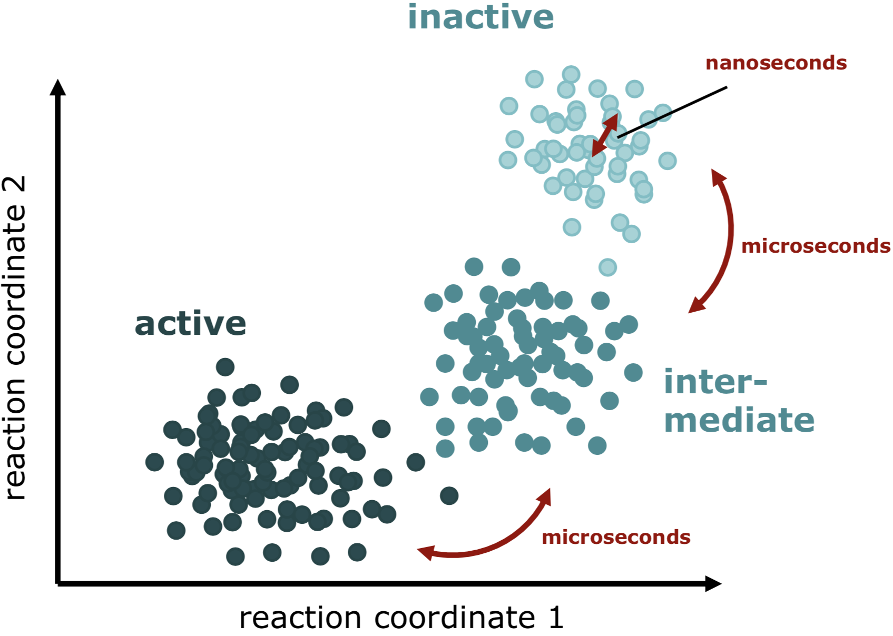

To perform a molecular simulation, it is important to use good experimental data:

* Crystallography allows a good resolution, and shows the average of a given conformational state.
* Spectroscopy (NMR/fluorescence): resolution-wise, small proteins offer a good resolution with this technique, while big proteins do not behave so well. As an advantage, it allows to see different structures (even if they are just changes of an inserted chemical probe).

## 1.3 Molecular Mechanics

Molecular mechanics is a computational method to calculate geometries and energies.

Systems are simplified in order to perform the calculations with larger molecules. An example of this is that atoms are treated as rubber balls of different size (atom types) joined together by springs of varying length.


Molecular mechanics enables the calculation of the total steric energy in terms of deviations from reference “unstrained” bond length angles and torsions plus non-bonded interaction (VdW, electrostatic):

$$
E_{tot} = E_{str} + E_{bend} + E_{tor} + E_{elec} + E_{vdb} + ... 
$$

### Types of Energy

**Stretching Energy**

* It consists on a sum of the energy of each bond.
* There are two parameters that are assigned to each pair of bonded atoms based on their type (e.g. C-C, C-H):
	* $k_b$: spring constant, controls the stiffness of the bond: the higher, the stiffer, which means that more energy is required to deform the bond from its equilibrium value.
	* $r_0$: it comes from experiments such as nature, crystallography, ab initio; or from quantum mechanics calculations. It is collected in the force field file.
* High differences between $r$ and $r_0$ increase the energy.

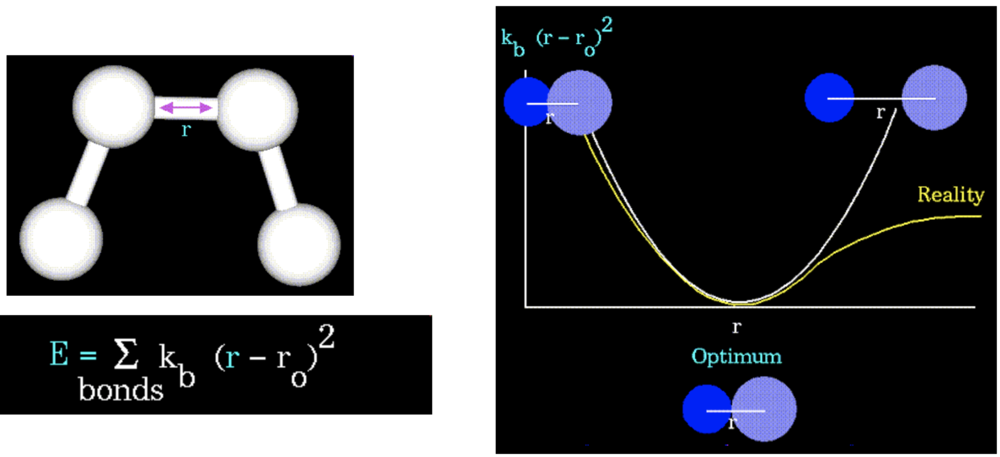

**Bending Energy**

* The equation estimates the energy associated with the vibration about the equilibrium bond angle.
* In this case, parameters are assigned to triplets of atoms, based on their type.
	* $\theta_0$: reference value for which energy E adopts the optimum.
	* $K_0$: controls the stiffness of the angle spring. A larger value means that more energy is required to deform or bond the angle from its equilibrium value. 

<!--The reference is still in the force field.-->

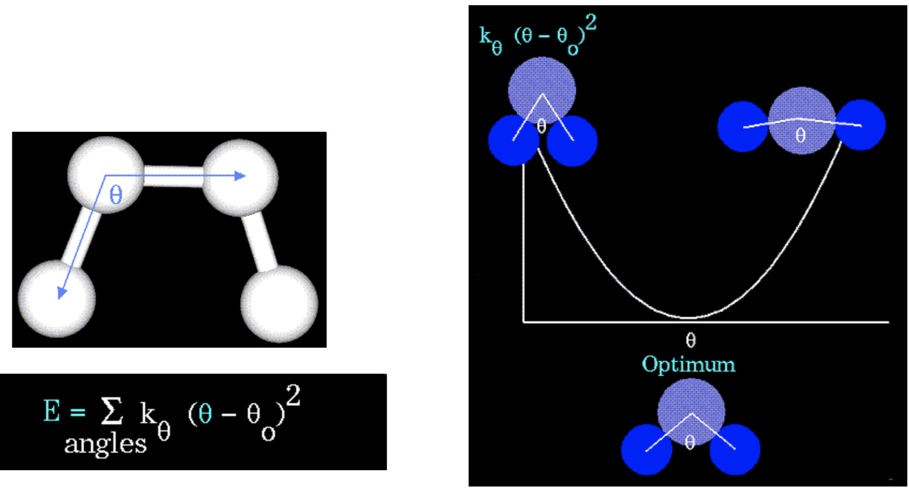

**Torsion Energy**

* Torsion energy can be considered as how one part rotates in reference to the other.
* It corrects the other energy terms, rather than representing a physical process. It makes the total energy agree with the experiment.
* Parameters are asssigned to quartets of atoms:
	* $A$: controls the amplitude of the curve.
	* $n$: controls its periodicity
	* ɸ: shifts the entire curve along the rotation angle axis $\tau$.
* It is modeled by a simple periodic function, which has this form because rotation can keep happening.

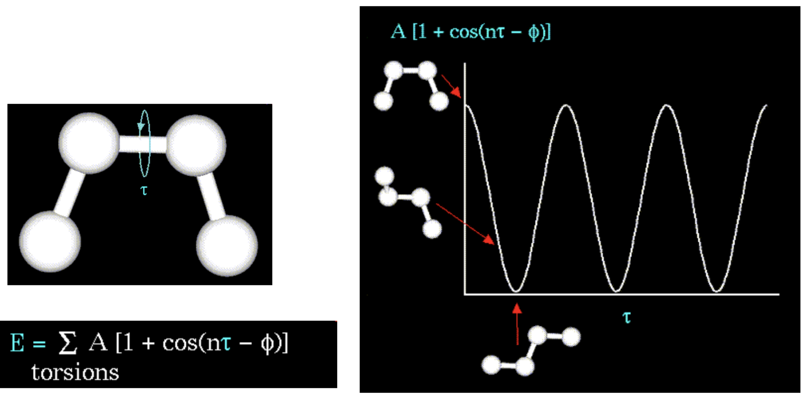

In the example, it is not very preferred and A would be high.

**Non-Bonded Energy**

* It is the combination of two terms: van der Waals and electrostatic.
* In both terms, $r_{ij}$ represents radius.
* The fact that they are summing means that in long distance they do not feal each other.
* Van der Waals
	* Approximated by a Lennard-Jones 6-12 potential. Itself has two terms, attraction and repulsion:
		* Attraction: it occurs at a short range, and rapidly dies off when the distance between the interacting pair of atoms increases (by just a few armstrongs, as it has a 1/r^6 dependency).
		* Repulsion: occurs when the distance is slightly less than the sum of their contact radii. It is modeled by an equation that  is designed to rapidly blow up at close distances  (1/r^12 dependency).
	* There are two parameters (which are defined in the force field) that control the depth and position (interatomic distance) of the potential energy well for a given pair of atoms:
		* $A$ defines stickinness of the attraction. It has a negative sign.
		* $B$ defines the level of hardness of the atoms (marshmallow-like, billiard ball-like, etc.): sof atoms can be deformed when they are close, hard cannot. It belongs to the repulsion term.
* Electrostatic energy:
	* It is approximated by a Coulomb potential.
	* It is a function of the charge of each atom ($q_i$ and $q_j$), their interatomic distance ($r_{ij}$) and a molecular dielectric expression that accounts for the attenuation of electrostatic interaction by the environment (such as the solvent or the molecule itself).

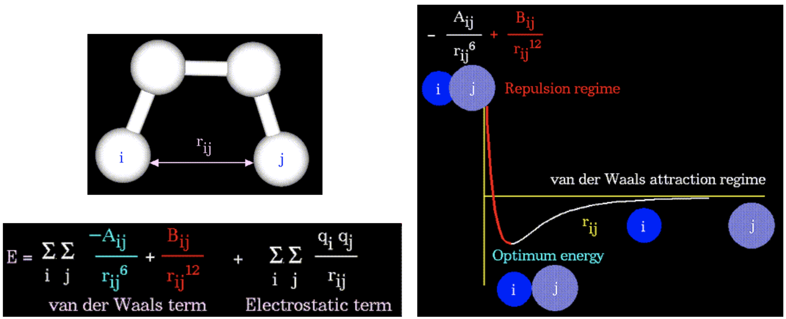

* Sum: in long distances they dont feel each other.

**Summary**

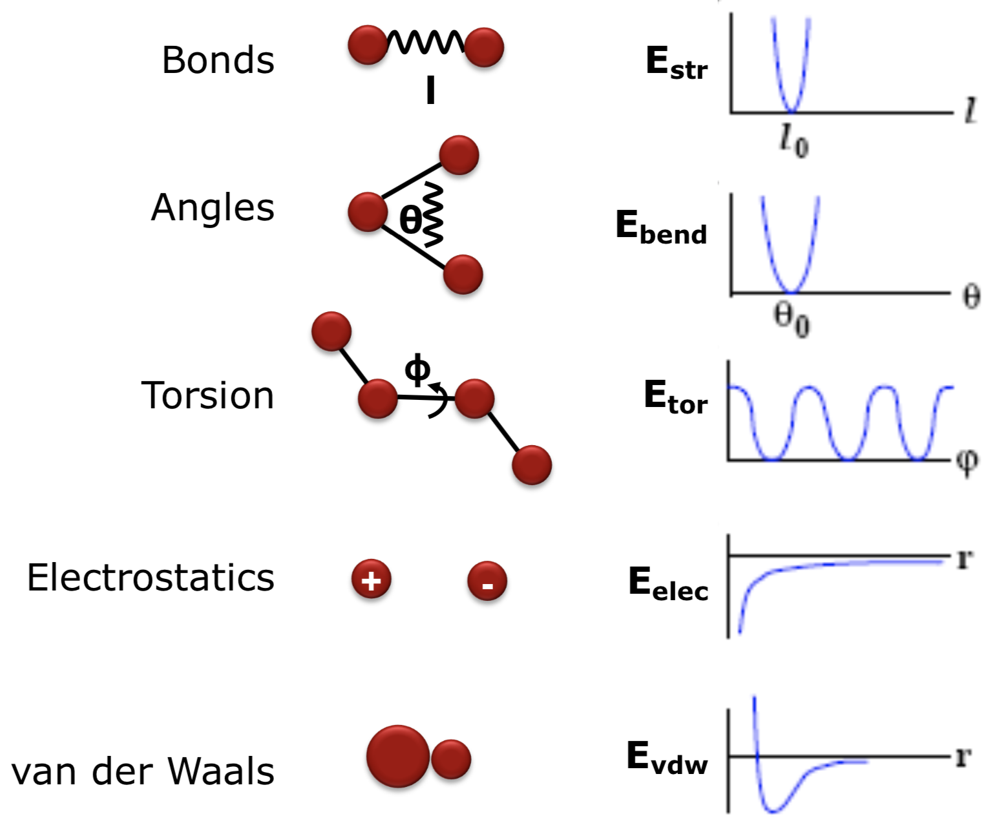

**Types of Force Field**

Force fields contain parameters of the energies we have seen and potential energy functions, which enable molecular mechanics calculations.

There are different types of force field, depending on the application. They evolve, as the longer simulation times allow to see problems, which are corrected.

In a CHARMM36 force field, we can observe:

* The mass of the atoms (even for different types of the same element).
* Bond definition.
* Spring constants for two atoms.
* Angle definition and spring constants for angles (three atoms).
* It finishes with comments, which defines the origin of the information contained in the force field.


----------------
Slide 29

* Newton's law is done iteratively.
* First problem:
* phase space: 
* The highest is the h bonds. We can fix them to speed up the process.
* From a doubt: In the simulation, you dont really fix H from side chain and backbone (but you can if you add more restraints).   

* In a first step, calculare whatever and get acting force.
* Then, acceleration.
* Then you cal calc velocity. Then you know where it will be in 2 femto. The assign of velocity in some stuff is assigned randomly? and it depends on the temperature of the simulation: temperature is reflected in the vel.
* Theb, move time forward and repeat as long as you need.

* Leap-frog: velocity is calc ar a time, and as 1/2 the vel is calculated in between (so it is a reference of a medium).
* In the below explain, positions r at time t is actially delta t (typo).

### Simulation env

* Water atoms are more realistic. Vacuum is unrealistic.
* Some approaches put dielectric constants of solvents to solve it, but its not as good as having water.
* Water models have been created.
	* Vibration is kind of stiff.
	* TIP:
	* SPC: 
	* They try to build a model with the properties below.

**TIP models**

------

How much water do we need?

More 'space' requires more computation.

I dont understand periodic boundary conditions.

You set up a kind of box. It doesnt take the time, just the space into account.

**Short and long range inter**

Electro inter have a long range.

The slide with a graph that seems like vdw is of the non-bonded interactions.At some point you put a cutoff that you dont want to calculate whatever anymore.

-----

Andersen thermostat is not in all simulation software.

**Control for pressure and chem poteintial**

Controlled by size of cell. Higher pressure: small cell.

Chem potential: add/rem particles.

-----

Limitations

* Ensembles: you keep some param fixed.
* Canonical Ensemble has a thermostat.
* Isobaric also has the barostat.

### Typical MD Simulation

* get a PDB struc.
* As side chains are flex, some dont appear. Add them.
* Protonation states: things can be protonated or deprotonated. Asp can have or not an hydrogen. Compute if there should be a proton or not, depending to the environment and side chain position.
* Simulation files: add solvents, take right parameters.
* Energy min: optimize geometry.
* Equilibration: to get right box size.
* Run production sim


ACEMD is commercial but really fast. Runs on GPUs (better parallelization).
GROMACS has also a GPU version. We will use it as it is open source.

## 2. VMD

<!--Date: 04/04/2019-->

### Visualization and Basic Analysis of Simulations

Open 1UBQT.pdb the structure with File > New Molecule...

The `Mouse` menu allows to change between modes, but there are also keys:

* `R` for rotation mode.
* `T` for translation mode.
* `S` for scale mode (zoom in/out).

Other useful keys:

* `1` to click on atoms.
* `2` to click on bonds.
* `3` to click on angles.
* `4` to click on dihedrals (torsion angles, between 4 atoms ⚛️).
* `=` to re-center view.

#### Representations

The `Graphics > Representation` menu controls everything about the representation, with options to manipulate it. It is divided in various tabs:

* Draw settings: includes the coloring method and the drawing method. Drawing methods such as 'Lines' allow to change thickness.

Some drawing methods:

* VDW: atoms are represented as spheres. Allows changing the Sphere Scale and Sphere Resolution
* Tube: allows to see the shape of the backbone. *You can change its side*
* NewCartoon: highlights second structure traits (*useful to count them*).

Coloring methods: *S is in yellow*

* Name: each atom has its own color
* Residue type: self-descriptive.

<!--Append the drawing methods image-->

> In our example we observe a beta sheet (formed by 4 beta strands. The arrow represents the C-terminal. A beta sheet can be parallel or antiparallel depending on the direction of the strand. As this has both, it is a mixed beta sheet.
> 
> The small helix is a little bit tighter than a normal alpha helix. <!--Add the image in slide 11 about structure of ubiquitin-->

Other tab is called **Selections**. It allows to select certain elements, to create representations about them or to hide what we are not interested in (*for example, we can have all protein in the line drawing method, but serines in VDW*). This relies on **keywords** (*i.e. selecting alpha helix and then index, shows the atom numbers, starting by 0*).

```reformat
> PDB Files. Index 1 of pdb in vmd shows the dirst atom. Keywords in vmd are equivalent to pdb files.
>
>Selet vdw and in selection type index 1: shows first atom. Then index 1 to 10
>
>also resid 1-10 (first strand of beta sheet if we put new cartoon again.
>
>in name N in VDW, we see
>
>res name in selection, keyword resname shows the residues there. It doesnt change when i say resname LYS THR but it should show them
>
>if you type
>
>use x-y-z coordinates:
>
> x>10 armstrong
```

In selections, connectors `and`, `or` and `not` can be used to define more complex selections. Examples:

* `betasheet and name N` to select nitrogens in the beta sheets. or to see both.
* `not betasheet and not helix` to select just loops.
* `water within 3 of protein` water molecules within 3 armstrongs of the protein. The bigger the armstrongs, the more water molecules we see. <!--Doubt, guess i need a specific drawing method or something to see them-->

Finally, particular representations can be saved. When we have multiple ones, we can deactivate some (to focus) or see all of them at once (to highlight traits in the context of the structure).

When we finish creating representations of a protein and we have it as we want, we can save this information for another session with the menu `File -> Save State` or create an image with `File -> Render`

<!--Tasks: put the why globulins have shape, sequence viewer extension-->

#### Scripting with Tcl

The Tcl scripting language can be used to automate actions in VMD. It is a straightforward way to work. It can be accessed through `Extensions > Console`.

Some basics:

* Printing: `puts "Hello World!"`.
* Arithmetic operations: `expr -3 * 10`.
* Variables: `set x [expr -3 * 10]`.
* Printing variables: `puts $x`.

We can select and measure atoms:

```reformat
set sel [atomselect top "all"] (top is the id or smth.

Now we can make questions ab selection $sel num gives 660.

set sel [atomselect top "hydrophobic and name N"

To show polar, we need blabla

From slide:
set sel [atomselect top "all"]
$sel num
$sel moveby {10 0 0}
set sel [atomselect top "hydrophobic"] $sel get resname
set sel [atomselect top "hydrophobic and name CA"] $sel get resname
$sel get {resname resid}
measure center $sel
measure minmax $sel
```

If we don't know a particular command, we can activate `File > Log Tcl Commands to Console` and then do what we want graphically. We will see in the console the equivalent command.

### Visualization of MDs

Dynamics of drug receptor interactions: the delta opioid receptor bound to naltrindole.

First we need to open the following file `structure_WT.pdb` as new molecule. Once we've done it, select `Load Data into Molecule` and choose the `.dcd` file (which contains the frames). To finish, load the visualization state (`.vmd` extension).

Perform RMSD alignment (Extensions > Analisys > RMSD Trajectory Tool

Steps in slide

Plot saved as rmsd_plot.ps

Natrindol rings

3: 1
5: 2 <!--Ask about the strange oxygen-->
6: 4 (2 are aromatic

so we need to do a selection of ALA LEU VAL ILE PRO PHE MET TRP that are at least 3 armstrongs

((resname ALA or resname LEU or resname VAL or resname ILE or resname PRO or resname PHE or resname MET or resname TRP) as within 3 of resname EJ4) and not hydrogen

((resname ALA or resname LEU or resname VAL or resname ILE or resname PRO or resname PHE or resname MET or resname TRP) as within 3 of resname EJ4) and not hydrogen

resname ALA as within 3 of resname EJ4 and not hydrogen

tenemos gly, tyr308, lys, VAL217, MET132, TRP274, ILE304, VAL281, tyr129, trp284

ASP128
TYR308
GLY307
LYS214
**MET132**
**VAL217**
**TRP274**
**ILE304**
**VAL281**
TYR129
TYR308
ASP128
**TRP284**

q9: tyr129

## Class 3: GROMACS

<!--Date 09/04/2019-->

### NOTES TAKEN IN CLASS

### Introduction

The goal of today is to learn to setup a simulation with GROMACS. An overview of the pipeline that the program follows is:

<!--Insert image from PDF-->

1. Checking the PDB file for missing parts. Certain parts of the structure are too flexible to be captured by X-rays. This usully happens with the surface of the protein, as it is interacting with the solvent.
2. Add hydrogens to the structure and generate the topology with `pdb2gmx`.
3. Build a simulation box with `editconf` and fill it with a solvent with `solvate`.
4. Add ions with `genion` to neutralize possible net charges.
5. Use `grompp` to combine different inuts into a binary `.tpr` file.
6. Run mdrun to simulate.
7. Analyse the simulation.

### Preparation of the Structure

Most of this part is already "done", as the structure we use does not have missing parts. The only thing we need to do remove the water molecules from the PDB file with the text editor of our choice.

### Generation of the Topology File

We look into the topology file. It has info ab the molecule. You get 4 each residue the atom tyoe, resnumber atom itself, charge, mass, sum of the charge.

Some extra things it says. We are going to do equilibration by constraining heavy atoms (those that are not hydrogen).

At the bottom there is a list of molecules: we will put more molecules in the next steps there.

### Box Definition and Solvation

This is done with `editconf` and `solvate`. We will use a cubic box, but using a rhombic dodecahedral box would be a better option, as it optimizes the volume. This accelerates computation because there are less solvent molecules.

> We make the periodic boundary conditions in this boxes. *I don't know where this comes from, i think it has to do with the size of the box*. Even in assymetric proteins there is always 1 nm of distance between the protein and the box wall.

Once we solvate the protein, we can observe in the topology file that a certain amount of solvent has been added to the molecules list.

The water module we use (spc model) is used as an standard by GROMACS, but there are other models.

Neutralize the system. Reasons:

* In nature, net charge is neutral, so our system also does it. But how much do we need to add? We can see in the topology file a sum of the charges: its net charge.

This step is not so straightforward. First, it requires to create a `.tpr` file (as in the simulations). It is a binary file that compiles the information of the input. This files are always generated using `grompp`.

The input needed for adding ions is the solvation box and the topology file, and also a `.mdp` file (which is provided by the tutorial).

Once the binary file is generated, run `genion`. It generates another `.gro` file, edits the topology file (to add the ions to the molecules list).

We add Na or Cl to neutralize (depends on the net charge. It is also needed to select which type of molecule will be exchanged (solvent molecules in this case, as we don't want it to exchange protein atoms). This changes are reflected both in the `.gro` and topology files.

> It seems that the output of `genion` already tells how many ions were added, so it's not really needed to open the topology file.
> 
> Anyway, we can observe the `.gro` file in VMD to check if the ions were added: open it and create a representation with a selection `ions` and draw them as VDW.

In nature net charges are zero. Maybe they concentrate somewhere, or move, but net is zero.

------

### Minimization

Solvated neutralized system. Reason: we added estimated hydrogens (maybe they need to be minim and also find their right orientation within the system). We also added water and ions.

At the beginning we have to find some positional constraits, which is only heavy tom. During this minim basically you minimize in the 1st step the H atoms. For that you need to use grompp to make a binary file with info from topology, coordinates and the mdp protocol. 

> This protocols can be obtained from publications when we want to repeat what was published, but if not they are kind of dependent on the force field you are using. Most of the values are default values, but you can do whatever you want if you can justify it. The more you imulate, you learn more what he parameters should be. Starting with cutoffs of how many minimizations, this is basically something that is learnt by doing. It is also possible to optimize protocols for types of proteins (i.e. proteases) and use this protocol for all of them. *And I guess you use it as a template, modifying it a bit for specific proteins within the type*.

> Minimization is important because if you start from high energies, the simularion algorithm explodes.

Some stuff contained in the minimization protocol:

* Integrator: steepest descent minimization.
	> When minimizing you don't explore the entire energetic landscape, but go to the next local minimum. The global might be in other place. The algorithm always looks that the structure is going down, it will never try to go up. 
* When to stop the minimization, based in what happens first:
	* A certain number of iterations (50000 in this case).
	* When the maximum force is below a certain value.
* Cutoffs for non-bonded interactions (electrostatic, VDW), divided in:
	* Short interactions: treated with the potential energy function, which is 10 A.
	* Long interctions are treated with the (...) equation, an approximation to solve and converge quickly on the long range using Fourier space.
* A list of pairs. Always calc bw 2 particles. To speed up calculations there is a step where it checks, makes a list of pairs around a certain atom and checks, puts (...) and then you only need to calculate from this list of pairs the non-bonded interactions. This is updated each timestep. *<I don't understand this part*
* Cutoffs scheme: a neighbor searching? just means to the normal cutoff. Srves as a kind of buffer that maybe a atom moves slightly from the cutodd so its buffered a little bit. *neither this one*

**Results of the minimization**

When we run the EM, the outputs are:

* em.log: ASCII-text log file of the EM process
* em.edr: Binary energy file
* em.trr: Binary full-precision trajectory
* em.gro: Energy-minimized structure

We can use `.edr` files to analyse the whole minimization (as it contains the energy of every step). We first convert it to a non-binary format with `energy`. The command always prompts what you want to compute. In this case, we type `10`.

The resulting file can be plotted with our plotting tool of choice.

> With GNUplot, the fist lines of the file need to be removed, ad the command is `plot '<filename>.xvg' with line`

We can see an animation of the minimization by opening the molecule (the last `.gro`), and then opening the `.trr` file with "Load into molecule".

> She says she is disapponted as the `.trr` only contained one frame, so it' not a real animation. We could have configured it to contain more frames.

### Equilibration

The equilibration has two steps. For both of them, a `.mdp` protocol and the generation of a binary `.tpr` is needed.

The structure input is the minimized one, with the topology. The protocol nvt.mdp: constant volume and temperature. We want to equilibrate this ensemble.

* We try not to use position restraints on the protein. That means water and ions can move and also actually the side chains of the protein, but not the backbone.
* Integrator: leap-frog intgrator.
* 50000 integrations, one integration step we use 2 fs. 2*50000 = we simulate foe 100 ps.
* Output control: how often we save a frame into the trajectory file. Step here refers to fs, so each one picosecond it writes a frame.
* Same thing for velocities and energy, and the log file.
* Bond-parameters:
	* First, say if the simulation is a continuation of other or not (in this case it's not).
	* Then, (from theory class): we can apply a timestep of 2 fs because we constrain all H bonds, which is the fastest vibration (it is below 2 fs).
		* When simulating one itration, you have to do it capturing the fastest movement in the systems (H vibration 0.5 fs). We can do the iteration faster by constraining H bonds, so they don't vibrate and are always kept at the same distance. Therefore we define this. Taking off the constraint would mean that we woud go to a lower timestamp and see the bond vibrations. 
* Nonbonded-param
* Cutoff: 1 nm
* The buffer
* List of atoms within the 1 nm cutoff but it has a buffers to 1.2 nm (so if during the simulation it moves, we still consider it as within 1 nm).
* Electrostatic
* The PME: we have to get an approx for long-range because if not it is computationally too demanding, so there are different things you can use but the one ther eis the most default one.
* A aram  for cubic box interpolation. Something about Fourier and a grid with 0.6 nm (at each point you calculate the electrostatics).
* A thermostat to control the temperature.
* A reference temperature (300 K, usual for running simulations).
* As we don't use NPT (yet) there is not barostat.
* Periodic boundary conditions
* Velocity generations: yes, because we start from the beginning, so we want to start the molecule according to the kinetic energy and the temperature (...) Maxwell distribution.

Afte doing this equilibration, we take the result, use `energy` and plot `temperature.xvg`. We want to see if the system has a constant temperature or not.

Now we **generate the NPT ensemble to continue the simulation**, by adding a barostat. There two main changes in the `.mdp` protocol. If we look it:

* It defines that we continue from a previous simulation (the NTP).
* It has pressure coupling on (it was off before.

> The input to do the plot can be found in `3.5_NPT`.

### Production Run

Generate the `.tpr` using the proper protocol, the structure obtained from NPT and the topology file.

### Analysis

For the analysis, the simulation needs to be aligned and centered on the protein. For that, you can check if the protein is stable or not by calculating the RMSD. You choose the backbone atoms. Make a plot of the RMSD. Check if the protein changes conformation or converges to a more or less stable conformation.

> To do this from the output she gives, go to the folder.

Usually RMSD changes: increases a little bit and maybe it changes again, and identify different conformations of the protein. We observe how the protein tries to converge to something.

We can also do this with VMD:

* Load `nvt.gro` (from a `3.5` folder).
* Then load inside the molecule `md_0_1.xtc` (from `3.7`). *This is the trajectory of last step. Now it is an `.xtc`, a more compressed simulation file*.
* Go to the RMSD Trajectory tool, click "Align" and then click "RMSD".

Random forgotten notes:

* take md_0_1.gro from 3.6
* class 3.7 xtc

### NOTES BY REPEATING THE TUTORIAL

#### Generate Topology

**Step One: Prepare the Topology**

* Hen egg white lysozyme (PDB code 1AKI), from [PDB](http://www.rcsb.org/pdb/home/home.do). Some preprocessing:
	* Delete waters:
		```
		grep -v HOH 1aki.pdb > 1AKI_clean.pdb
		```
		> This should not be done with all molecules: sometimes water is functional.
	* Check entries with the `MISSING` tag (atoms or whole residues not present). Absent terminal regions are not a problem. Model the molecule if needed, if not, `pdb2gmx` will fail. This module only genereates topologies.
* Next we execute `pdb2gmx`:
	* Command: `gmx pdb2gmx -f 1AKI_clean.pdb -o 1AKI_processed.gro -water spce`
		* It asks for a force field to process the molecule, in this case an all-atom OPLS force field (so type `15`). 
	* Generated files:
		* The topology for the molecule: `topol.top`
			* Contains all the information necessary to define the molecule within a simulation:
				* nonbonded parameters (atom types and charges)
				* bonded parameters (bonds, angles, and dihedrals) 
		* A position restraint file: `posre.itp`
			* defines a force constant used to keep atoms in place during equilibration  
		* A post-processed structure file: `1AKI_processed.gro`.
			* contains all the atoms defined within the force field (i.e., H atoms have been added to the amino acids in the protein)

There are many other options that can be passed to pdb2gmx. Some commonly used ones are listed here:

* -ignh: Ignore H atoms in the PDB file; especially useful for NMR structures. Otherwise, if H atoms are present, they must be in the named exactly how the force fields in GROMACS expect them to be. Different conventions exist, so dealing with H atoms can occasionally be a headache! If you need to preserve the initial H coordinates, but renaming is required, then the Linux sed command is your friend.
* -ter: Interactively assign charge states for N- and C-termini.
* -inter: Interactively assign charge states for Glu, Asp, Lys, Arg, and His; choose which Cys are involved in disulfide bonds.

**Step Two: Examine the Topology**

We can examinate the topology file with any text editor.

* It starts with comments (preceded by `;`).
* Then it has a line calling the force field file.
* After this, we find the protein name (Protein_A as the PDB had a chain A), ith 3 exclusions for bonden neighbors (read in manual).
* Then, there is a section that defines the atoms with several columns.
* Other sections are [ bonds ], [ pairs ], [ angles ], and [ dihedrals ]. <!--The parameters and function types associated with these sections are elaborated on in Chapter 5 of the GROMACS manual-->
* Then there is a call for the position restraints, which are in a file also created by pdb2gmx.
* Remainder: defining other molecules (solvent, ions) and providing system-level descriptions (system that will be printed in the output and a list of all molecules in the system).

> The type of water is SPC/E, as we passed `-water spce`. Other typical choices for water include SPC, TIP3P, and TIP4P.
> 
> We observe in the file that water is position-restrained, using a force constant (k_pr) of 1000 kJ mol-1 nm-2.

--

> key notes about the [ molecules ] directive:

> 1. The order of the listed molecules must exactly match the order of the molecules in the coordinate (in this case, .gro) file.
> 2. The names listed must match the [ moleculetype ] name for each species, not residue names or anything else.
> 
> If you fail to satisfy these concrete requirements at any time, you will get fatal errors from grompp (discussed later) about mismatched names, molecules not being found, or a number of others.

#### Define box and Solvate

**Step Three: Defining the Unit Cell & Adding Solvent**

* We will simulate in an aqueus system (though other solvents can be used).
* For this we define a box and fill it with solvent. This has two steps.

Define the box dimensions using the editconf module.

We will use a simple cubic box (but a rhombic dodecahedron is recommended, as its volume is ~71% of the cubic box of the same periodic distance, thus saving on the number of water molecules). The command is:

```
gmx editconf -f 1AKI_processed.gro -o 1AKI_newbox.gro -c -d 1.0 -bt cubic
```

In this command we say:

* Center the protein in the box (-c)
* Place it at least 1.0 nm from the box edge (-d 1.0)
* The box type is a cube (-bt cubic)

> Explanation of the distance:
> 
> Since we will be using periodic boundary conditions, we must satisfy the minimum image convention. That is, a protein should never see its periodic image, otherwise the forces calculated will be spurious. Specifying a solute-box distance of 1.0 nm will mean that there are at least 2.0 nm between any two periodic images of a protein. This distance will be sufficient for just about any cutoff scheme commonly used in simulations.
 
Next, we fill the box with water:

```
gmx solvate -cp 1AKI_newbox.gro -cs spc216.gro -o 1AKI_solv.gro -p topol.top
```

Explanation of the command:

* The configuration of the protein (-cp) is contained in the output of the previous editconf step
* The configuration of the solvent (-cs) is part of the standard GROMACS installation.
	* We are using spc216.gro, which is a generic equilibrated 3-point solvent model. You can use spc216.gro as the solvent configuration for SPC, SPC/E, or TIP3P water, since they are all three-point water models.
* Output: 1AKI_solv.gro
* We tell the name of the topology file (topol.top) to modify it (it writes the number of waters in the [ molecules ] directive, thi behaviour doesnt happen with non-water solvents).

#### Add ions

* `pdb2gmx`, based on the amino acid composition told us that the protein has a net charge of +8e (last line of your [ atoms ] directive in topol.top).
* Ions should be added to the system with the `genion` tool.
	* It reads through the topology replaces water molecules with the ions that the user specifies.
	* Its input is called run input file (.tpr), produced by the `grompp` module. It is also used when running the simulation.
		* `grompp` processes the coordinate file and topology (which describes the molecules) to generate an atomic-level input .tpr. This file contains all the parameters for all atoms in the system.

To produce the .tpr. a .mdp (molecular dynamics parameter file) is needed. grompp assemples the arameters of this file with the coordinates and topology into the tpr file.

> mdp file is normally used to run energy minimization or an MD simulation, but in this case is simply used to generate an atomic description of the system.

-- 

> *This file is fownloaded from the tutorial page*
> 
> In reality, the .mdp file used at this step can contain any legitimate combination of parameters. I typically use an energy-minimization script, because they are very basic and do not involve any complicated parameter combinations. Please note that the files provided with this tutorial are intended only for use with the OPLS-AA force field. Settings, particularly nonbonded interaction settings, will be different for other force fields.

Building the .tpr file is done with:

gmx grompp -f ions.mdp -c 1AKI_solv.gro -p topol.top -o ions.tpr

hen we pass the file to genion. It will prompt us, choose group 12 SOL (so it doesnt replace parts of the protein with ions):

gmx genion -s ions.tpr -o 1AKI_solv_ions.gro -p topol.top -pname NA -nname CL -neutral

The options of this command are:


* The input is a structure/state file (-s) as input.
* The output is a a .gro file (-o).
* Process the topology (-p) to reflect the removal of water molecules and addition of ions
* Define positive and negative ion names (-pname and -nname, respectively).
* Tell genion to add only the ions necessary to neutralize the net charge on the protein by adding the correct number of negative ions (-neutral, which in this case will add 8 Cl- ions to offset the +8 charge on the protein).
	* You can also use genion to add a specified concentration of ions in addition to simply neutralizing the system by specifying the -neutral and -conc options in conjunction. Refer to the genion man page for information on how to use these options.

About ion names: they used to be dependent on the specific force field file, but now they are standard. They are specified in capital letters. This molecule type is then written to the topology file:

```
[ molecules ]
; Compound      #mols
Protein_A         1
SOL           10636
CL                8
```

> Residue or atom names may or may not append the sign of the charge (+/-), depending on the force field. Do not use atom or residue names in the genion command, or you will encounter errors in subsequent steps.

#### Energy Minimization

**Step Five: Energy Minimization**

* Ensure that the system has no steric clashes or inappropriate geometry. The structure is relaxed through a process called energy minimization (EM).
* The process is similar to adding ions: grompp generates a tpr, but instead of using genion we use mdrun (GROMACS MD engine).
* Again, the input parameter file from gromp is given by the tutorial.

```
gmx grompp -f minim.mdp -c 1AKI_solv_ions.gro -p topol.top -o em.tpr
```

We proceed with the energy minimization:

```
gmx mdrun -v -deffnm em
```

* We run the command in verbose because it can be slow.
* The -deffnm flag will define the file names of the input and output. 
	* So, if you did not name your grompp output "em.tpr," you will have to explicitly specify its name with the mdrun -s flag. 

mdrun generates the followng files:

* em.log: ASCII-text log file of the EM process
* em.edr: Binary energy file
* em.trr: Binary full-precision trajectory
* em.gro: Energy-minimized structure

And this, even if we don't use verbose:

```
Steepest Descents converged to Fmax < 1000 in 831 steps
Potential Energy  = -5.8702450e+05
Maximum force     =  9.0797430e+02 on atom 736
Norm of force     =  2.0987490e+01
```

We can **evaluate** if the EM was successful by:

* Potential energy should be negative, and (for a simple protein in water) on the order of 10-5-10-6, depending on the system size and number of water molecules.
* The maximum force had a targe, specified at the *minim.mdp - "emtol = 1000.0"*
	* indicating a target Fmax of no greater than 1000 kJ mol-1 nm-1. It is possible to arrive at a reasonable Epot with Fmax > emtol. If this happens, your system may not be stable enough for simulation. Evaluate why it may be happening, and perhaps change your minimization parameters (integrator, emstep, etc).
* Also, the file em.edr contains all energy terms collected by GROMACS during EM. We can analyse it with the energy module:

	```
	gmx energy -f em.edr -o potential.xvg
	```
	> At the prompt, type "10 0" to select Potential (10); zero (0) terminates input
	
	* The result of this command is an average Epot and a file called potential xvg, which can be `ñptted. It will show a steady convergence of the Epot. can be plotted, and we'll see the average Epot 
	
		```
		Statistics over 831 steps [ 0.0000 through 830.0000 ps ], 1 data sets
		All statistics are over 658 points (frames)
		
		Energy                      Average   Err.Est.       RMSD  Tot-Drift
		-------------------------------------------------------------------------------
		Potential                   -564593      11000    28730.6     -75544  (kJ/mol)
		```
		<!--Insert the plot-->
		
#### Equilibration

Step Six: Equilibration

* Now, we have a reasonable starting structure in terms of geometry and solvent orientation.
* Now we should equilibrate the solvent and ions around the protein.
	* If not (unrestrained dynamics) the system may collapse, because the solvent is optimized within itself, and not necesarily with the solute.
	* We need to bring the solvent to the temperature we want to simulate. *The correct temperature is based on kinetic energies*.
	* Then, establish the proper orientation about the solute (the protein).
	* At last, we apply pressure to the system until it reaches the proper density.

We will use the posre.itp file that pdb2gmx generated:

* It applies position restraining forces on heavy atoms of the protein (non-H atoms).
	* This allows movement, but only after overcoming a substantial energy penalty.
	* Position restraints allow to equilibrate the solvent around the protein.
	* The origin of the position restraints (the coordinates at which the restraint potential is zero) is provided via a coordinate file passed to the -r option of grompp.

Equilibration is usually conducted in two phases:

* Phase 1: NVT ensemble (constant Number of particles, Volume, and Temperature), or "isothermal-isochoric" or "canonical".
	* The timeframe is dependent upon the contents of the system:
		* The temperature of the system should reach a plateau at the desired value.
		* If the temperature has not estabilized, then more time is required.
		* Typically, 100-150 ps should be enough.
	* A .mdp file is required for grompp to run (downloaded from tutorial). Some parameters are:
		* `gen_vel = yes`: Initiates velocity generation. Using different random seeds (`gen_seed`) gives different initial velocities, and thus multiple (different) simulations can be conducted from the same starting structure.
		* `tcoupl = V-rescale`: The velocity rescaling thermostat is an improvement upon the Berendsen weak coupling method, which did not reproduce a correct kinetic ensemble.
		* `pcoupl = no`: Pressure coupling is not applied.
* Phse 2: NPT or "isothermal-isobaric" ensemble, which more closely resembles experimental conditions.
	* This stabilizes the pressure (thus also the density) of the system.
	* Again, a mdp file is needed (and downloaded). It is similar to the nvt.mdp, but has some changes:
		* It has a pressure coupling section which uses the Parrinello-Rahman barostat. 
		* `continuation = yes`: We are continuing the simulation from the NVT equilibration phase
		* `gen_vel = no`: Velocities are read from the trajectory (see below).
	* Again, `grompp` is called and then we run the simulation and evaluate energies. 

The commands for the equilibration are:

```
mx grompp -f nvt.mdp -c em.gro -r em.gro -p topol.top -o nvt.tpr

gmx mdrun -deffnm nvt
```

Then we can anlyse the temperature progression:

```
gmx energy -f nvt.edr -o temperature.xvg
```

> Type `16 0` at the prompt to select the temperature of the system and exit.

In the pressure equilibration:

```
gmx grompp -f npt.mdp -c nvt.gro -r nvt.gro -t nvt.cpt -p topol.top -o npt.tpr

gmx mdrun -deffnm npt
```

> We are now including the -t flag to include the checkpoint file from the NVT equilibration; this file contains all the necessary state variables to continue our simulation. To conserve the velocities produced during NVT, we must include this file.
> 
> The coordinate file (-c) is the final output of the NVT simulation.

```
gmx energy -f npt.edr -o pressure.xvg
```

> Type `18 0` at the prompt to select the pressure of the system and exit.

The obtainded plots for temperaure are:

From the plot, it is clear that the temperature of the system quickly reaches the target value (300 K), and remains stable over the remainder of the equilibration. For this system, a shorter equilibration period (on the order of 50 ps) may have been adequate.

About the plots for pressure:

The pressure value fluctuates widely over the course of the 100-ps equilibration phase, but this behavior is not unexpected. The running average of these data are plotted as the red line in the plot. Over the course of the equilibration, the average value of the pressure is 7.5 ± 160.5 bar. Note that the reference temperature was set to 1 bar, so is this outcome acceptable? Pressure is a quantity that fluctuates widely over the course of an MD simulation, as is clear from the large root-mean-square fluctuation (160.5 bar), so statistically speaking, one cannot distinguish a difference between the obtained average (7.5 ± 160.5 bar) and the target/reference value (1 bar).

We also take a look at density:

```
gmx energy -f npt.edr -o density.xvg
```

> entering "24 0" at the prompt.

As with the pressure, the running average of the density is also plotted in red. The average value over the course of 100 ps is 1019 ± 3 kg m-3, close to the experimental value of 1000 kg m-3 and the expected density of the SPC/E model of 1008 kg m-3. The parameters for the SPC/E water model closely replicate experimental values for water. The density values are very stable over time, indicating that the system is well-equilibrated now with respect to pressure and density.

Please note: I frequently get questions about why density values obtained do not match my results. Pressure-related terms are slow to converge, and thus you may have to run NPT equilibration slightly longer than is specified here.

#### Production MD

**Step Eight: Production MD**

* The system is now well-equilibrated at the desired temperature and pressure.
* We will release the position restraints and run production MD for data collection.
* We will use of the checkpoint file which contains preserve pressure coupling information. This is used by grompp with a script called `md.mdp`:
	
	```
	gmx grompp -f md.mdp -c npt.gro -t npt.cpt -p topol.top -o md_0_1.tpr
	```
	> `grompp` will print an estimate of how many ocessors should be dedicated to the PME calculation:
	>
	> * For a cubic box, the optimal setup will have a PME load of 0.25 (3:1 PP:PME - we're very close to optimal!)
	> * For a dodecahedral box, the optimal PME load is 0.33 (2:1 PP:PME)
* Then, we run the simulation. It is a 1-ns imulation (guess the script specifies it).

	```
	gmx mdrun -deffnm md_0_1
	```

#### Analysis

**Step Nine: Analysis**

We use some of the GROMACS tools in order to analyse the simulation:

* `trjconv`: a post-processing tool to strip out coordinates, correct for periodicity, or manually alter the trajectory (time units, frame frequency, etc). **We'll use tis "corrected" trajectory for further analysis.**
	* In this exercise we use it to account for any periodicity in the system. The protein will diffuse through the unit cell, and may appear "broken" or may "jump" across to the other side of the box. To account for such actions, issue the following:
		
		```
		gmx trjconv -s md_0_1.tpr -f md_0_1.xtc -o md_0_1_noPBC.xtc -pbc mol -center
		```
		> Select 1 ("Protein") as the group to be centered and 0 ("System") for output
* With the trajectory obtained from last step, we can calculate the RMSD:
	
	```
	gmx rms -s md_0_1.tpr -f md_0_1_noPBC.xtc -o rmsd.xvg -tu ns
	```
	> Choose 4 ("Backbone") for both the least-squares fit and the group for RMSD calculation
	
	* The -tu flag will output the results in terms of ns, even though the trajectory was written in ps.
		* This is done for clarity of the output (especially if you have a long simulation - 1e+05 ps does not look as nice as 100 ns).
	* The output plot will show the RMSD relative to the structure present in the minimized, equilibrated system.
* We can also calculate the RMSD relative to the crystal structure:

	```
	gmx rms -s em.tpr -f md_0_1_noPBC.xtc -o rmsd_xtal.xvg -tu ns
	```
	
	* Both time series show the RMSD levels off to ~0.1 nm (1 Å), indicating that the structure is very stable. Subtle differences between the plots indicate that the structure at t = 0 ns is slightly different from this crystal structure. This is to be expected, since it has been energy-minimized, and because the position restraints are not 100% perfect, as discussed previously.
* With `gyrate` we can measure the radious of fyration (a measure of its compactness).
	
	```
	gmx gyrate -s md_0_1.tpr -f md_0_1_noPBC.xtc -o gyrate.xvg
	```
	> Choose group 1 (Protein) for analysis.
	
	* Two things can happen:
		* Maintaina a relatively stable value for R_g: it is stably folded.
		* R_g changes over time: the protein unfolds.


## Class 4. GROMACS II

<!--Date: 11/04/2019-->

First we focus a bit on some details, and then we analyse a simulation.

Min questions were about the simulation protocols, so here we go.

### Minimization Protocol

It is contained in the file `minim.mdp`.

#### Integrator

The integrator is the algorithm that performs the minimization. They look through the energetic landscape by different iterations. In each of them, they calculate the potential energy by summing all the energies of the system:

$$
E_{tot}=E_{str}+E_{bend}+E_{tor}+E_{vdw}+E_{ele}+...
$$

The steepest descent minimizer is a first order method, which gradually changes the coordinates of atoms as moving the system closer to the minimum.

It looks for local minimums. It starts in a random point, so it might fall in the global minimum or in a local minimum.

This algorithm can be explained with a 2D simplification, in which what it does is similar to a line search:

* Draw a line and pick 3 points on it randomly (as we don't know where the minimum for this line is).
* Calculate the potential energy function for each point.
* Get the point with less energy. Decide in which segment there could be a smaller energy. *In the picture E2 is the point with less energy, and that probably between it and E3 there is a smaller energy*.
* Put three points in the selected segment and calculate the energies.

The segment selection is repeated until the lowest point is found. When this happens, a perpendicular line that crosses the first through this point is drawn, and the three point strategy is done again.

Ths strategy is fast, but is forced to make right-angled turns at each point even though it might not be the best  route to the minimum. This acceptable in narrow/steep minimums, as it can go directly to the bottom.

> Gives undesirable properties in long narrow valley <!--Doubt-->

> Each iteration depicted by arrows in slide 11.

For shallow minimums, the conjugate gradient minimization is more appropiate. It is a bit more computationally expensive, as it stores data from previous iterations (history gradient information: performs calculations following a gradient). This information is used to choose a direction, which is used to go more directly for the local minimum.

### NVT Equilibration Protocol

It is contained in the `nvt.mdp` file.

#### Integrator

The integrator in this case uses a leap-frog algorithm. During the cycle of each iteration of the simulation, we have to obtain both the coordinates and the velocities of the atoms. This algorithm calculates each at different times:

* The coordinates are calculated at each time-step (in the tutorial, 2 fs).
* The velocities are calculated in the half-time.

This is done because the velocities can be very different, so the average of the velocities is taken. This approach also allows better parallelization (probably).

#### Output Control

The protocol defines how the data is stored. 

The coordinates are written to `.gro` files at each timestep. If a coordinates file was generated for each step, there would be a lot of files, so they are combined in a trajectory file (`.trr` or `.xtc` in the case of GROMACS, `.dcd` in NAMD).

> We write out the coordinates in each file, 2fs each gro file corresponds to 1 ps, so each gro is a frame or step. The time of the ste depended on the frequencies.

Other files in the output are the energy file (binary) and the log file.

#### Bond Parameters: Constraints

The vibrations of the hydrogen bonds are the fastest of the system. By constraining them, we can use timesteps of 2 fs.

#### Nonbonded Settings

Calculating non-bonded interactions in too much detail is computationally very expensive for for big systems such as proteins or in fields such as drug design (tough it is possible to do it with small systems). Then, a cutoff scheme is used.

The cutoff scheme of this protocol is Verlet, and it performs a buffered neighbor search within certain cutoffs:

* Coulomb for short-range electrostatic interactions.
* VDW interactions.

It calculates the non-bonded interactions by combining whatever. This is speeded up by the fact that beforehand, a list of atoms is calculated, and the interactions are calculated based on this list.

> Pairs of atoms have a role here <!--Doubt-->

During simulations, one pair of atoms is above the cutoff, so is not in the list. To prevent a problem, a buffer is used, so pairs with a slightly larger radius can be included in the list.

> I think in this case it has a default buffer, you don't give a temperature.

#### Electrostatics

For long-range electrstatic interactions, calculations are performed in a Fourier space (so it is an approximation).

> In the image, positive charges are red, and you see how actually the PMD density looks like, so its an approx.
> 

> **Some notes about the cutoffs and other values:**
> 
> Cutoff values have been proved for many years, so typically the same ones are used. They are changed when the problem is very specific (this is usually related with temperatures).
> 
> When a lot of data is being generated, it is saved at bigger timestamps. But when a really fast event has to be observed, saving more frames (smaller timestamp) is adequate.
> 
> Fourier spacing and grid spacing: when you have a grid, it is required to define the space between each point that is calculated. The smaller the space, the higher the computation. The spacing values we see have been used for decades.

#### Temperature Coupling

When there are a lot of cutoffs, energy is lost and this adds inaccuracy. This has to be compensated by adjusting by whatever velocities. *More information about this and pressure coupling in the future*.

#### Periodic Boundary Conditions

They are normally used. Maybe they arent if the simulations are in vacuum.

#### Velocities

When starting the simulation atoms do not have velocities yet. They are assigned (randomly, basically).

Velocities are coupled to temperature (the higher, the faster and viceversa). This doesn't mean that at a certain temperature all molecules have the same velocity: we observe that they correspond to a distribution: maybe some molecules are slower and others way faster, but most of them are at an average velocity (or closer to it).

In the following image we observe how the maxwell distribution is for two samples at different temperatures:

* Each follows a different distribution.

In the simulation, the velocities are assigned based on the Maxwell distribution.


* Cold temp: you would have a certain distr, 2 molecules are very slow and 2 very high, the average velocity lies whatever and the higher, the better c_cold and v_warm is the average. Most molecules are on the average.
	* As the system is closed, the number of molecules is limited. There is a top to the molecules in the graph of the distr bc we work in closed systems.
	* So we assign (for xample, to the solvent the average speed of the maxwell distr). Certain temp doesnt mean that the atom has just one velocity, we have to look at the distr of all molecules.
	* Here we use it for assigning velocities, but if you go further and rescale velocities then you still use the distr to be sure that all the system follows a normal distribution.  In the next step you collect the velocities, so they are not reassigned.
	* gen_seed is random, means the vel, the distr, the average vel fulfilled, but it could be that  an atom is faster than other. This makes sure that if yu start form the same system the you can deviate into diff firection and evolve it into diff directions  which we like to see, because better for cnformation space.
	* The assignment of vel is not the same for a heavy or light atom: the average velocity is proportional to sqrt(boltzmann*T/m), so the heavier, the slower.

> If we had a system with 5 molecules, maybe 1 would be slower. Increasing the temperature would increase the velocities, but the slower one might still be slower than the others.


--------------------------
	
#### Analysis of the Simulation in VMD

<!--Audio: from 40:30-->

**Examination the Simulation**

We open VMD and we load the following files from `GROMACS_output/complex`:

* Load the structure file `npt.gro`.
* Load the trajectory `md_01.xtc` into `npt.gro`.

We observe a lot of lines. If we create a representation for *resid 9780* (a water) with CPK, we observe that one of the hydrogen bonds is normal, but the other has a long bond.

The reason is that the hydrogen lies where the box finishes. In the simulation it would be moving to the next periodic box, but in this representation we see it in the other side of the box. 

So this lines are an artifact caused by the periodic boundary conditions. If we rewrapped the molecules around the protein so they won't split, we would see the entire molecules, not the artifact (as they wouldn't split from one image to the other).

We can observe this with a representation of *resid 8429* with licorice: we will observe how it appears on different sides during the simulation.

Next, we create the following representations:

* Protein with cartoon
* Ions with VDW

If we play the simulation, we observe that some ions disappear. If we create a representation for *resid 10772* (an ion) and hide the other representations (except the protein) we will observe how it appears on different sides during the simulation. This is also caused by the boundary conditions.

> Wrapping centers the protein in the middle so it doesn't get splitted. We could also define that ions or waters shouldn't be splitted. This is specially applicable with proteins with more than one atom, as we can see half a molecule in one side and the other half in the opposite. Ins are not a good example, as they are just one atom and don't split. Just "teletransport".

**Alignment and Backbone RMSD as a first step of analysis**

Playing the simulation at a faster speed allows to see a bit of we see the difussion and rotation of the protein. If we want to analyse this, we need to align.

> We align to the backbone. Sometimes you just align to helices or whatever to focus on different things.

We open the RMSD Trajectory Tool and we make sure that the *Backbone* box is checked and that the first frame is the reference. Then, we click on align then to RMSD (the *Plot* box needs to be checked).

The RMSD goes around 1.2, which is normal for a system. It doesn't have big conformational changes, just adjusts a little bit the backbone. *It is important to see if the protein is stable or does crazy things, based on the RMSD*.

**Average RMSD per residue**

The plot we obtained is an average for all backbone atoms. Now we wold like to see *inhibitor region of the protein*, the prot has a chain of residues (from 1 to 100) we want  to see for each residue what is the RMSD. We can define regions that are more flexible.

Calculating the average rmsd is done by looking at each frame (ref frame is usually the first one).

We want to find the average RMSD over time of each residue in the protein. Again, we will consider the first frame as the reference, so the second frame is compared to the first, checks how much the residue changed and puts an RMSD. Also for the third, and so.

> It doesnt matter which frame is the reference, but we always need to compre to the reference.
> 

We use a script that stores data and contains a function that you use to calc the rmsd of the residue over time. To use it, we need to define our selection (what you want to calculate the rmsd over). It is defined in the slide.

* top is used when we have more molecules, you see the id in the window list, we can highlight one with a T, that is the top one.

The RMSD per residue. We'll see the more stable residues and which fluctuate more. See for each residue. The other was the whole structure.

protein and alpha: in the pdb the name calls. the atom type. By selecting c alpha is resume dfor alpha. You could also say name calpha We select just one atom per residue (a residue has usually 10-15 atoms, we pick one  bc we want the resid) If we picked more than one atom, we'll hace a lot of resids per residue (so the name would be repeated). Thats why we select just one atom. We can see in other examples what happens when you select more than one atom per residue.

This is achieved with tcl scripting. We need to call the script:

```tcl
source residue_rmsd.tcl
```

```tcl
cd class4/GROMACS_output/complex
source

set sel_resid [[atomselect top "protein and CA"] get resid]
```
> : gets a smaller list, just CA

An erroneous way to do the selection is:

```tcl
set sel_resid [[atomselect top "protein"] get resid]
```
> You get 20 times '1', because the residue has 20 atoms, for each atom you get the resid.

```tcl
set sel_resid [[atomselect top "protein and CA"] get resid]
```

> The list here is smaller, as we are selecting just alpha carbons.

> **View more about the residues by looking at slide 35**
> 

Once we set the selection, we pass it to the function with function name + structure + selection:

```tcl
rmsd_residue_over_time top $sel_resid
```

As a result we will obtain a file called `residue_rmsd.dat` (in the `complex` folder). We have to plot it to identify residues with large conformational changes during energy optimization.

> Seems the terminal also gives the list of the average RMSD per residue, but we use the printed file for convenience.

From the plot, we observe that some residues with high RMSD are 15, 68, 35, 114, 128 (they appear as peaks).

> gnuplot plot dat with line

Represent them with VDW and colored by name and play the simulation.

```
resid 15 or resid 35 or resid 68 or resid 114 or resid 128
```

Where are the residues with a high RMSD located?

The residues with a high RMSD are located in the surface (including the coils). This residues interact with the solvate and are very flexible. These residues are the ones that normally are problematic to crystalise. In the crysta they usually have high V values. Match experiment with analysis: you can explain x-ray struct with this.

**Showing the Flexibility**

The flexibility of a residue can be made visible by simultaneously showing multiple conformational states along the simulation.

Create a representation with the residues with high RMSD with drawing method "Licorice". Remove the hydrogens from the selection.

```
(and no h)
```

Then go to the Trajectory tab and in the field "Draw Multiple Frames" type `0:10:102`, which means write from frames 1 to 102 with a step of 10.

This can also be done with the protein. 

**Electrostatic Interactions**

Salt bridges have an important contribution to protein stability. They can be found with Extensions > Analysis > Salt Bridges.

This generates a series of files with information about the salt bridges, which can be plotted.

Substrates and ligands often use a water channel to reach the active site of the protein. To identify water channels, we can generate an occupancy map of water (Extensions > Analysis > VolMap Tool).

> We select water within 3 of protein so we don't have all the representation filled with water. The volmap type is "occupancy" because it is easy to interpret (1 = always there, 0.5 half time of simulation). 

<!--Insert screenshot-->

It will create an Isosurface representation. Color it with colorid 15 to distinguish from the protein.

Then, create a VolumeSlice Representation. Move it along an axis and identify better the axis. Try different axis (in this case, it is the Y). We will see here the water enters: that is the pocket.

We want to know if the pocket is hydrophobix or polar. To do this:

* Create a representation of the protein (lines colored by name)
* Check residues along the pocket.
* Create a representation with those residues to highlight them (use the resid, VDW and color by name).

--

> Seems some residues she selects are:
> 
> * trp28, leu56, trp 108, , 31, 8, 12
> 
> The residues I select are: trp108, leu56, met 12, ile 55, , glu 35, ala 31, trp28
> 
> ile 55 no tan cerca
> 

List of hydrophobic residues: ALA LEU VAL ILE PRO PHE MET TRP

trp108 (A), leu56 (A), met 12, ile 55, , glu 35, ala 31, trp28

The pocket is hydrophobic


> Nice pocket to target. when you see water in a hole you expect certain feature. If it is for instance hydrophobic the ligand dispaces waters and we get a nice affinity


put waters areound in a repr to see how they go in and out

water and same residue as within 3 of resid (update selection for every frame and color every frame)

Sum of the missing parts: ion binding sites search with volmap. Ions lie around or stably bind somewhere? If so, you would see it in the occupancy map for the ions. this seems to be q5

## Class 5. Application of MD to a Membrane Protein

<!--Date: 25/04/2019-->

We use [CHARMM-GUI](http://www.charmm-gui.org/?doc=input) to set up the simulation. After that, the equilibration and production steps are done with GROMACS. Finally, the simulation is analysed.

### Simulation Setup

When using CHARMM-GUI, the following steps are followed:

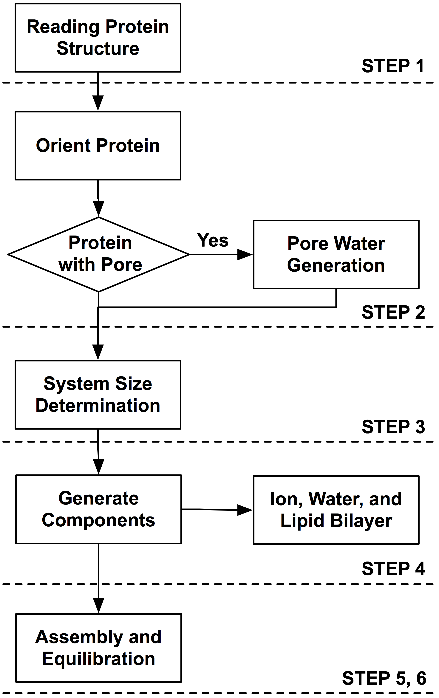

#### Step 0: Structure Preparation

VMD is used to prepare the protein ([3PBL](https://www.rcsb.org/structure/3pbl)) in this case.

When we open it, we observe that it has two receptors. Normally, the one that has less missing segments/atoms structure is taken. We will keep chain A, as there is not much difference.

> Represent chain A as NewCartoon to see which one it is.

To save the chain into another file, we open the TkConsole:

```tk
set sel [atomselect top "chain A"]
$sel writepdb 3pdbl_chainA.pdb 
```

> This script just takes the chain A of structure marked as top. The `atomselect` key is used to select parts of a structure. The selection is saved into a variable, which later is used to generate the PDB.
> 

We load the new file and observe it:

So the chain A, after loading, will look like this:

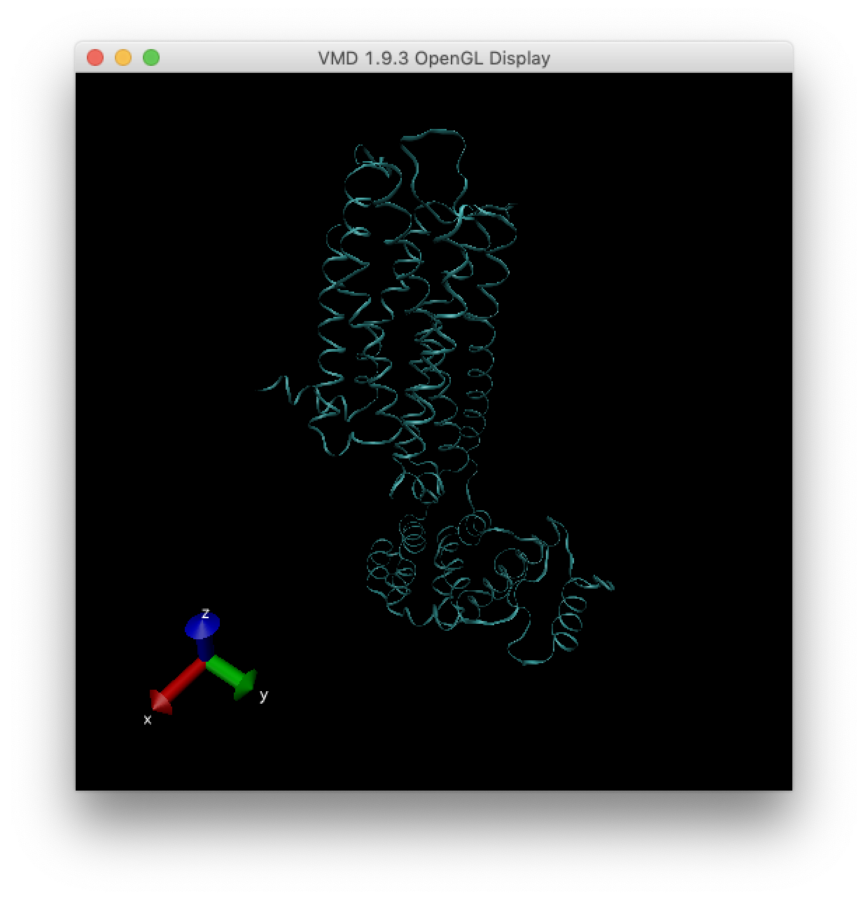

It still contains the T4 lysozime (introduced into the receptor to facilitate crystallisation).

In order to remove it, we use again Tk, but first we need to know which residues are the lysozime and with the chain. The residue IDs can be checked with the Sequence Viewer. In it, we can see how the residue number goes from 221 to 1002 suddently: that is the lysozyme. *Prot goes *

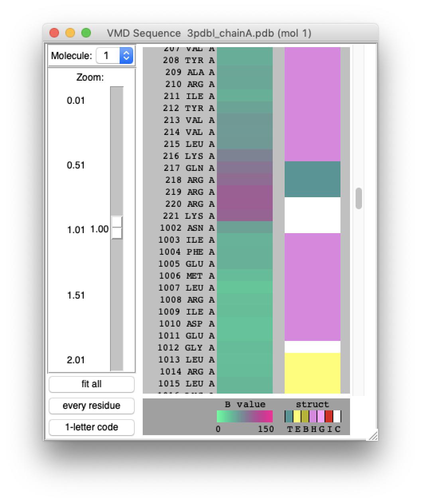

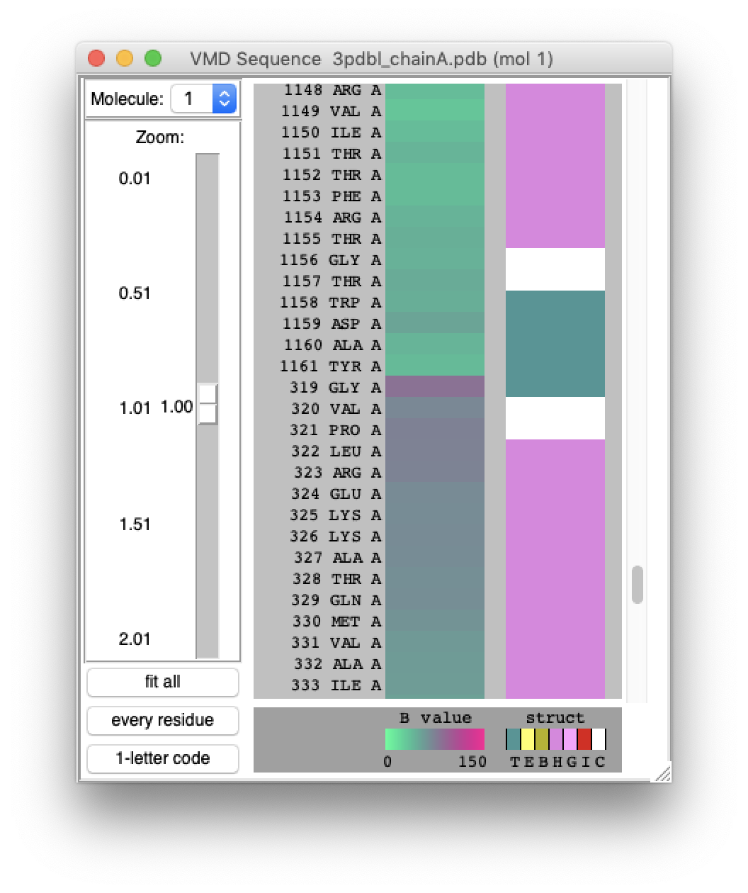

The selection is done with:

```tcl
set sel [atomselect top "resid < 1000 or resid > 1200"]

$sel writepdb 3pbl_chainA_cut.pdb
```
> We know thay the protein goes until residue 222 and then restarts at 319, and also, over 1200 is not the lysozime.
> 

The resulting structure is shown in the image, but if we create a VDW representatin with "not protein" as selection, we will see small molecules:

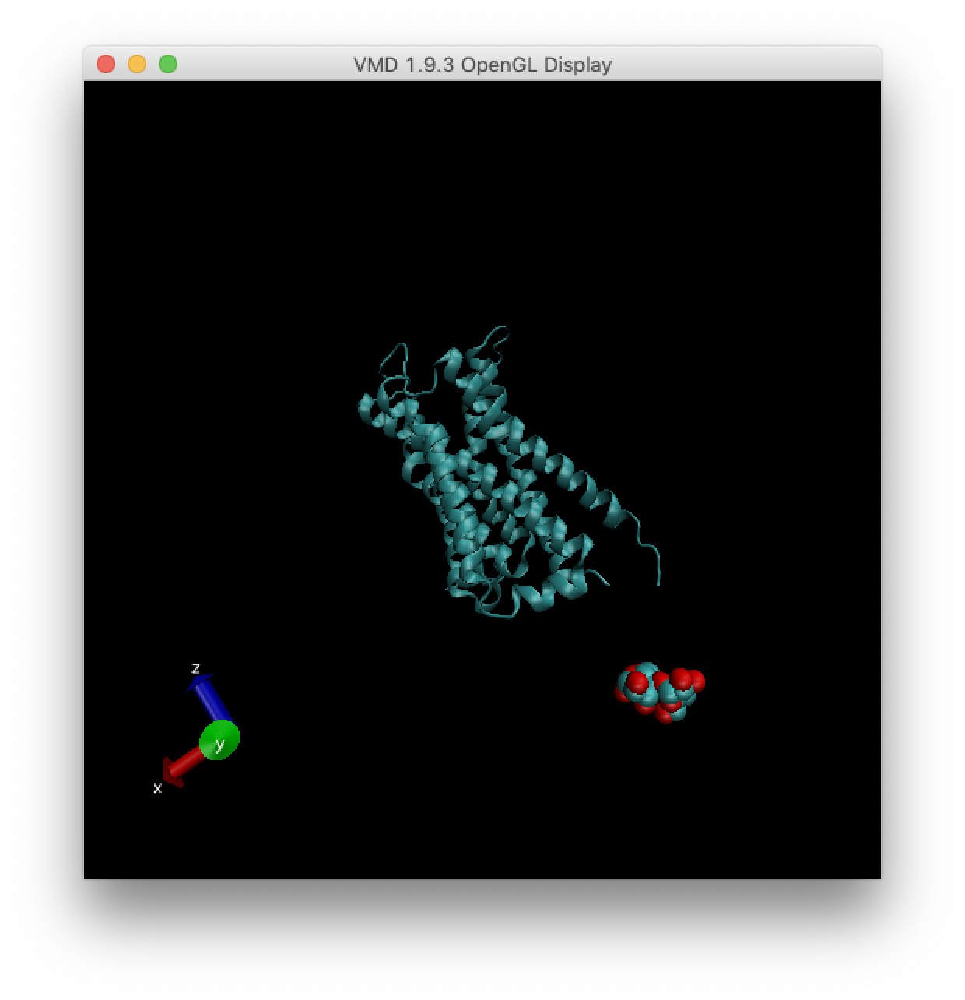

Those need to be removed:

```tcl
set sel [atomselect top "protein"]
$sel writepdb 3pbl_chainA_cut_protein.pdb
```

**<New chain ID's**

With the removal of the lysozyme, a broken loop appeared (221-319, 100 residues difference between them). This is a bit artificial and has potential to mess up, so we will assign a chain ID to each chain, and save it:

```tcl
set sel1 [atomselect top "resid 1 to 221"]
set sel2 [atomselect top "resid > 318"]

$sel1 set chain A
$sel2 set chain B

set sel [atomselect top "protein"]
$sel writepdb 3pbl_chainA_final.pdb
```

Result:

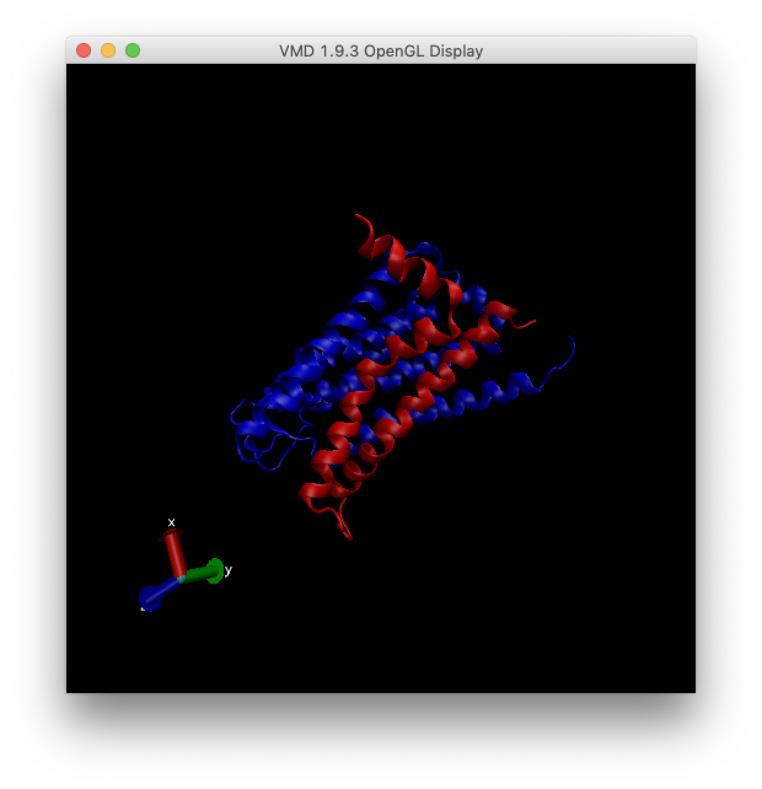

### Simulation Setup

**Upload and Selection**

The procedure starts by going to the CHARMM-GUI membrane builder and uploading the structure. Then it will allow to select the chains (not selected by default, make sure that both A and B are selected).

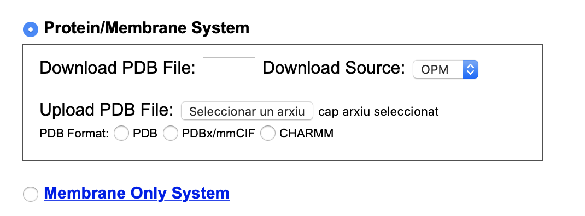

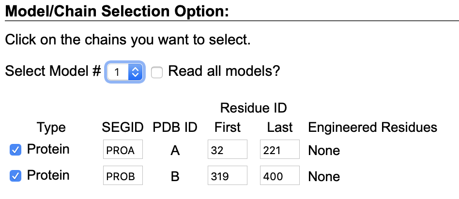

**PDB Manipulation**

The gap that we were talking about before generates two N and C-terminal ends. To avoid charged artifacts with them, they are capped with ACE and CT3, so they remain neutral.

The disulfide bonds need to be identified. To know where they are, we go back to VMD:

* Select all cysteine residues
* Draw method: licorice
* Color: by name

If we remove the rest of representations, we will see that some cysteines are together: those are the bonds. We can select the atoms to see the residue ID.

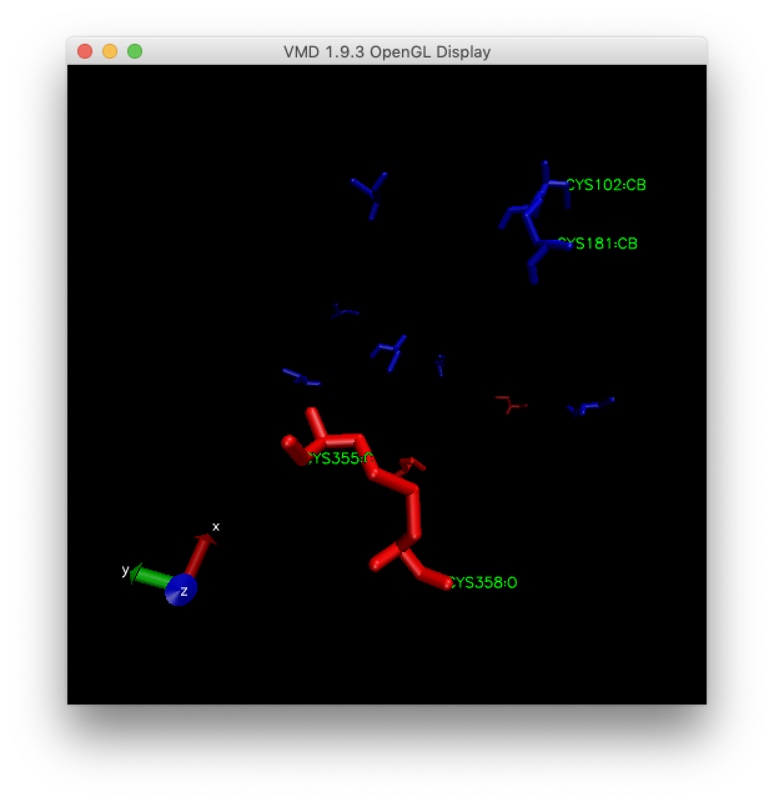

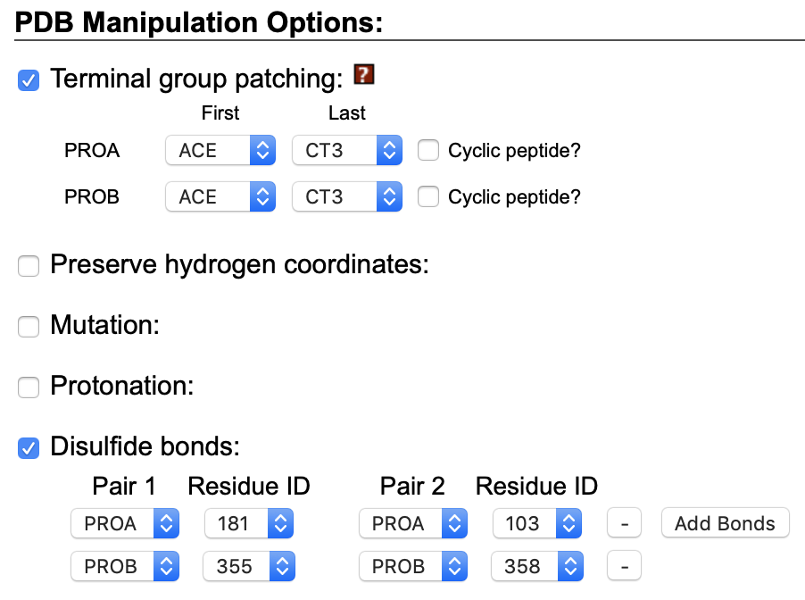

**Generate PDB and Orient Molecule**

Orienting the protein because...

In the case of GPCRs, we use "Align the First Principal Axis Along Z".

Lastly, the D3R has a pore were small ligands bind. This has to be filled with water. We do it with the option *Using protein geometry*.

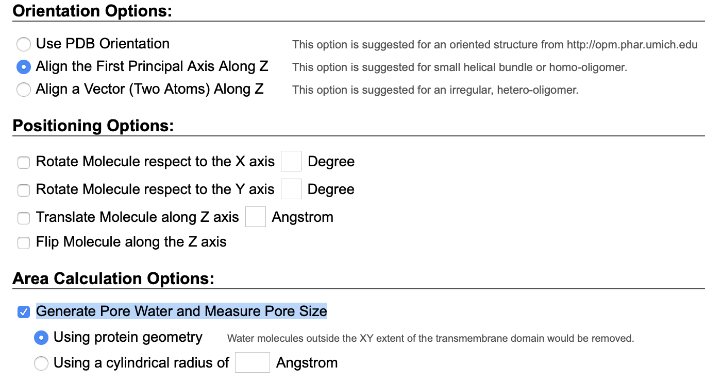

<!--min 41.-->

**Calculate Cross-Sectional Area** <!--min 44-->

When the calculation is performed, two plots and some characteristics are returned, which say if the protein was well oriented or not:

* Protein Top Area: 1190.41383
* Protein Bot Area: 1139.70367
* Pore Minimum Radius: 0

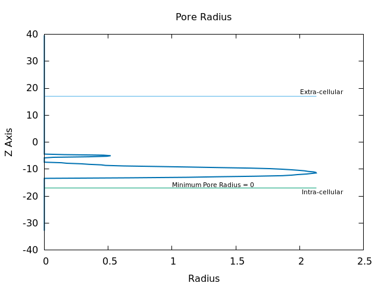

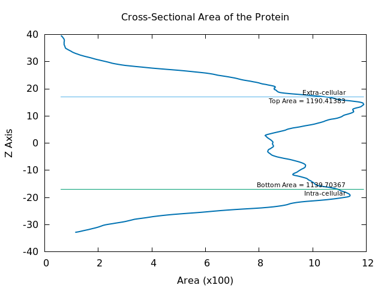

**System Size Determination**

In this step, we choose the box type and its size:

* The box will be rectangular.
* Length of Z will be based on a water thickness of 12 (A or nm??<!--doubt-->. This is done to maintain the system as small as possible.
* Length of X and Y will be based on the ratios of lipid components, but we need to guess a size. We put 80 (80x80).

Next, there is a table with lipids, wich contains lipid types. The upperleaflet and lowerleaflet ratios refer to each side of the membrane. We choose POPC as the lipid, with a 1-1 ratio (*same amount of lipids on each side*).

Finally, we click on the "Show the system info" button. With that information, we can know if the system is to small.

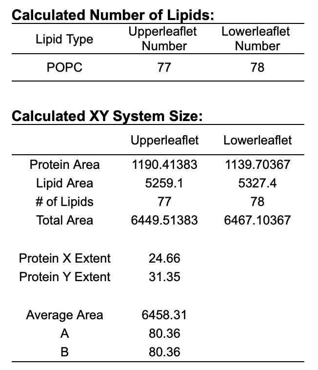

If we click on `step3_packing.pdb`, we can see the result so far.

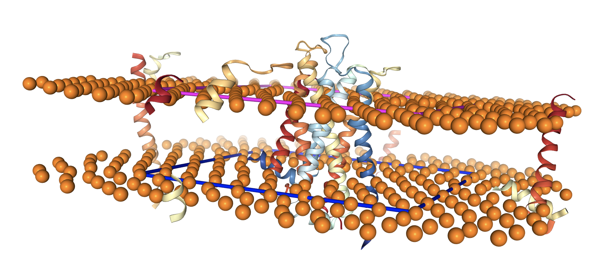

**Generate Components**

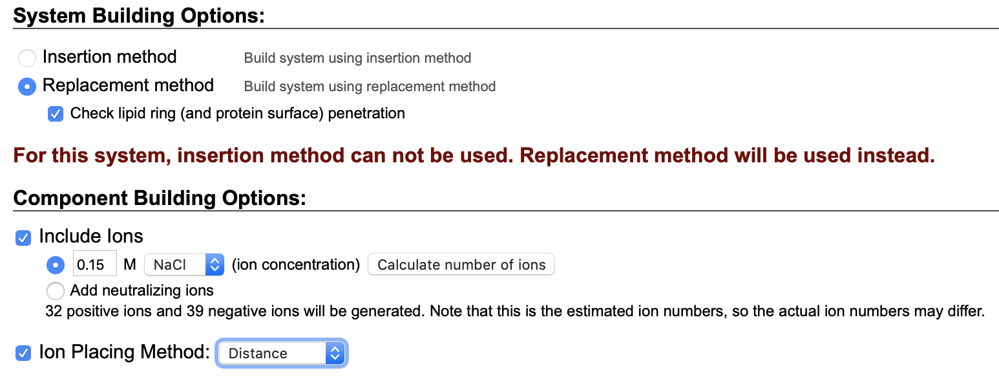

> There are two popular methods commonly used to build a realistic protein/membrane complex. In the first method, lipid-like pseudo atoms are first distributed around a protein and then replaced by lipid molecules one at a time [19]–[21]. Individual lipid molecules are randomly selected from a lipid library that contains various conformations of lipid molecules. This method allows one to easily control the system size and the number of lipid molecules while it generates a lipid bilayer nicely packed around the protein. In the second method, a hole is first created in a pre-equilibrated lipid bilayer and then the membrane protein is inserted into the hole [22]–[24]. In general, weak repulsive radial forces perpendicular to the membrane normal are applied to a lipid bilayer until the hole is large enough to accommodate the protein. This method provides a well-equilibrated lipid bilayer, and one might expect less equilibration time than in the first method. For the sake of convenience, the first method is called the “replacement method” and the second method is called the “insertion method” hereinafter. Although both methods are well explained in the literature [19]–[24], considerable efforts and experiences with MD simulation software are required to build a realistic protein/membrane system.
> 
> From [this paper](https://journals.plos.org/plosone/article?id=10.1371/journal.pone.0000880)
> 

Q2: 


----

Check lipid penetration

The protein surface penetration check finds the lipid tails that go beyond the protein surface, and the lipid ring penetration check detects the lipid tails that pass through the cyclic groups (e.g., cholesterol ring) in the simulation systems. Energy minimization can resolve many of these bad contacts, but one might need to visually check the following lipid molecules to ensure the following contacts are resolved. The user can regenerate the lipid bilayer if necessary.
Protein surface penetration:

No protein surface penetration is found.
Lipid ring penetration:
No lipid ring penetration is found.
Building Ion and Waterbox

Membrane components are generated. Due to time constrains, we first generate the lipid bilayer then generate ions and the water box. Click "Next Step" to generate ions and the water box.

----

**Define equilibration conditions** <!--Before min 1:05-->

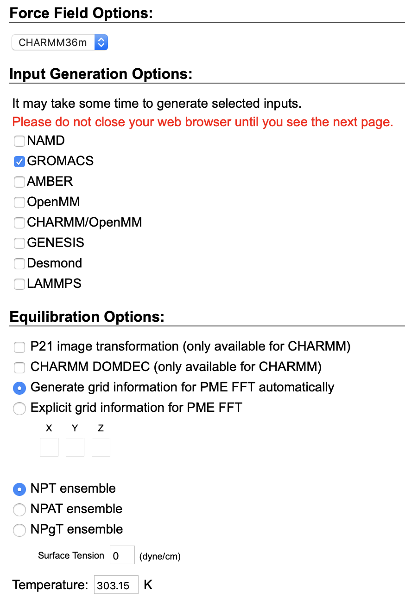

Finally, we download all files.

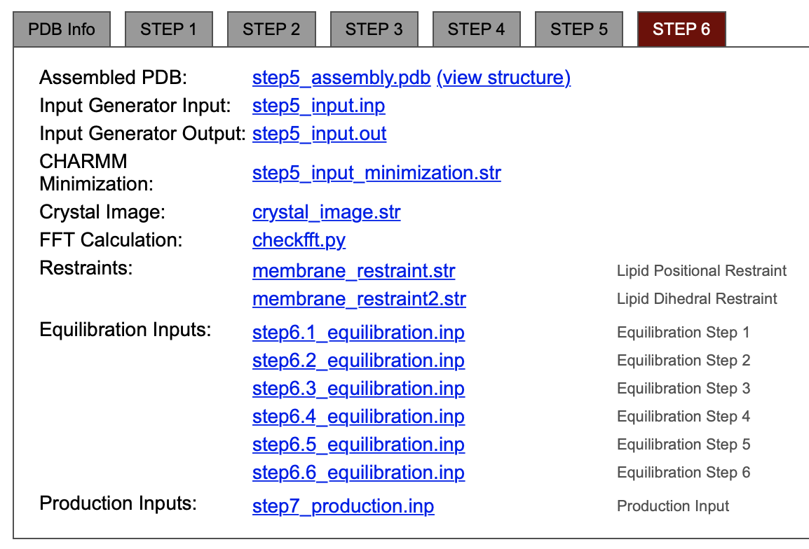

### Equilibration and Production

In the `2_equilibration_and_production` directory, there are some restraints of the system that are applied during the equilibration. They are:

* BB: force constant to keep the backbone atoms constraint.
* SC: force constant to keep the sidechain atoms constraint.
* wforce: force constant to keep the water molecules away from the hydrophobic core.
* tforce: force constant to keep the lipid tail below +/- %.
* mforce: force constant to keep the lipid head groups close to target values.

The two first retraints apply to the protein. Then, the lipids are packed around the protein (before there were some empty spaces) and water is prevented from entering the membrane.

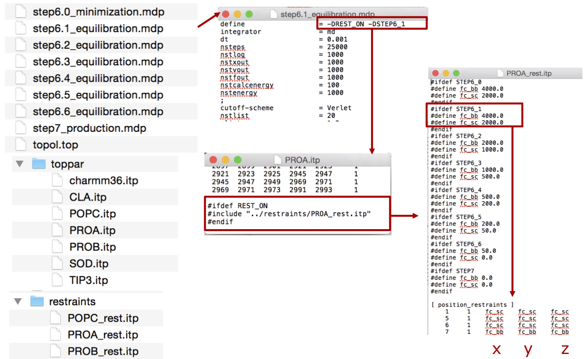

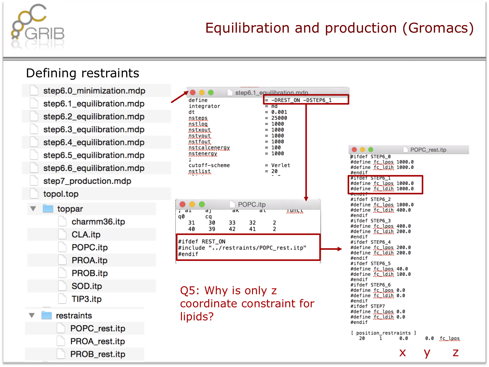

Now look ar her files, the folder we said. Inside, gromacs. Interested in steps 6 to 7. Around min 1:18.

Proa_rest_itp: fc_bb is force constraint backbone.

`toppar` contains stuff about the molecules found in our simulation.

Fixed only one atom of the head. You don't allow to move it from z so it doestn move up and down: they just diffuse along x and z.

There is a slide on how to run it.

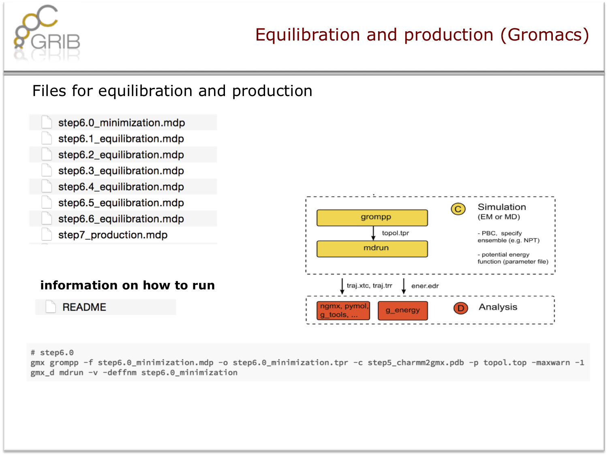

### Analysis

The function of many GPCRs is sensitive to sodium ions. We will: 

* Detect sodium ion binding sites by computing the occupancy map.
* Generate a figure showing residues that bind the ion and label these residues (e.g. D400).
* Generate a plot that shows the ion entrance over time by plotting the Z coordinate over time.

Open the `.psf` with VMD and then load the `.xtc` into it.

> Tip: as the simulation has too many frames, we can make it less comoutationally intensive by decreasing the number of frames: right click the simulation and choose "Delete frames". In stride put two, so it reduces the number of frames by half:
> 
> 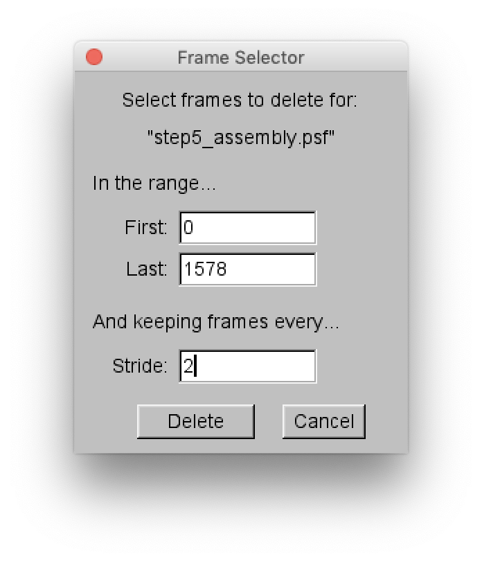

A first observation is that waters are very dynamic, as they can travel a lot. But we don't care about this because we don't analyse water.

The first thing to do is aligning the backbone of the protein with the RMSD Trajectories tool (*check the backbone box*).

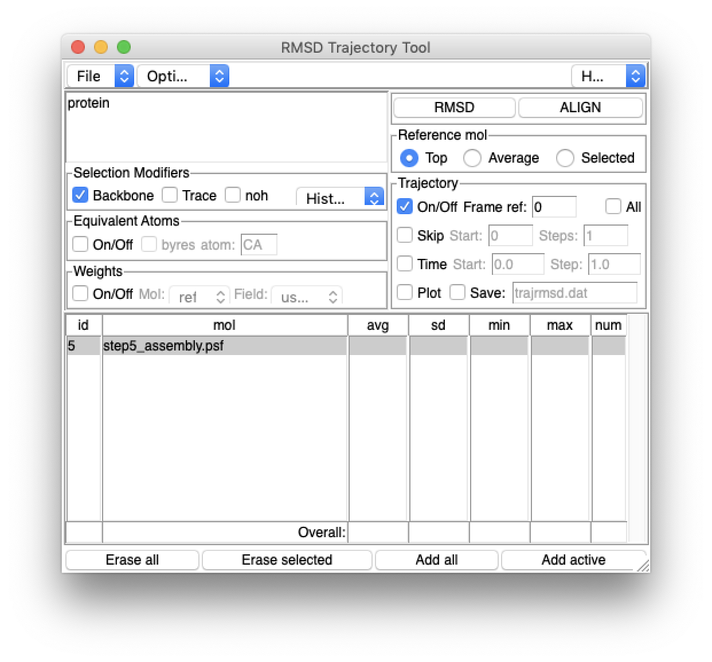

Next, a VolMap is generated with:

* Selection: resname SOD and within 5 of protein
* Type: occupancy


When this is done, go to the generated representation and plot it as isosurface with a value of 0.01. It is also a good idea to make it translucent instead of opaque.

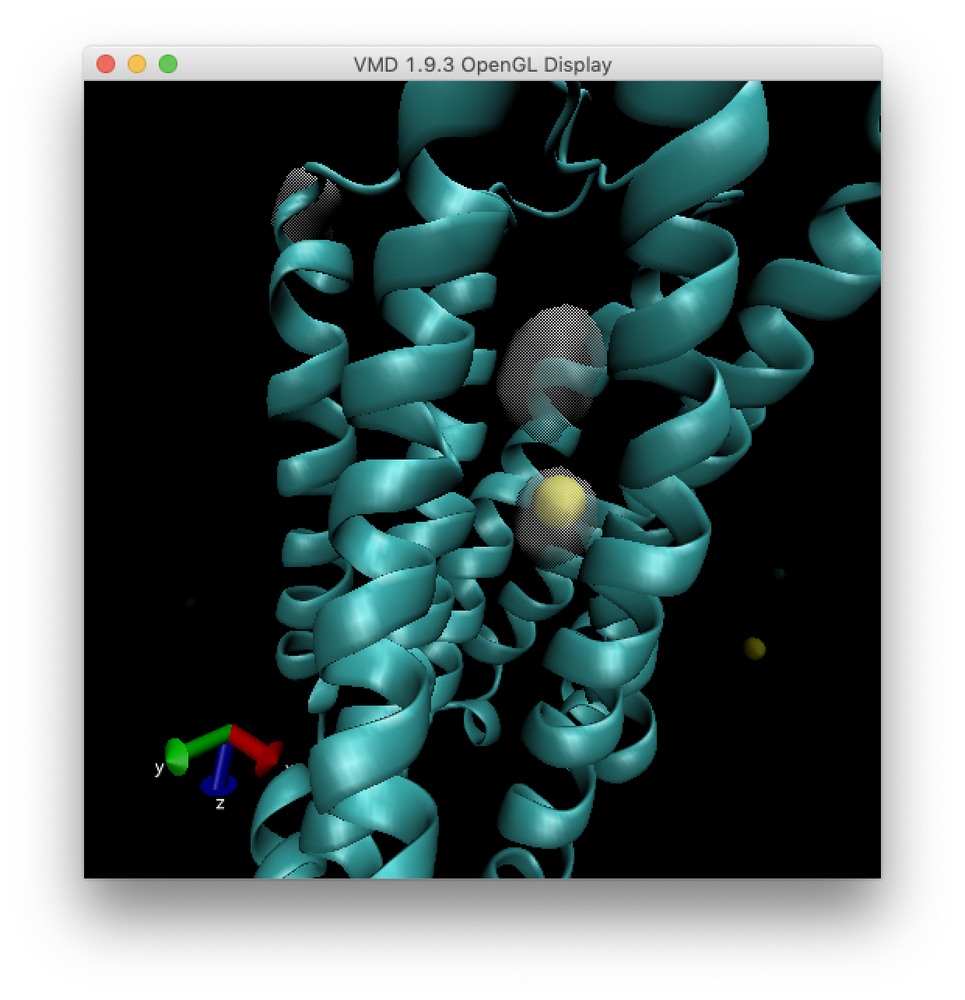

In the simulation we saw that one of the ions entered the channel, stayed at one point and then goes further inside. The VolMap confirms this behaviour: we observe two very defined binding sites.

To plot the ion entrance over time, the following steps are needed:

* To get the index, select it and go to labels. In this case, it is 56129 (this can change for each simulation).
	
* Using a script, select your ion and obtain the Z coordinate:
	```
	set sel [atomselect top "index 56129"]
	$sel get z
	```

The last step gives the same information as the labels window: the Z coordinate for the current frame. In order to get the coordinate for each frame, a loop is needed:

```tcl
# Open file to write
set file [open "sodium.dat" w]

# 1. Define your selection
set sel [atomselect top "index 56129"]

# Second: know how many frames:
set n [molinfo top get numframes]

for { set i 0 } { $i < $n } { incr i } {
# update selection for current frame
	$sel frame $i
	$sel update

# assign z coord
	set position [$sel get z]

# Write frame and position to file
	puts $file "$i $position"
}
	
close $file
```

> The selection must always be updated, if not it will go to the last frame.

## Class 6: Markov-Based Analysis of Biomolecular Systems

<!--Date: 26/04/2019-->

Toni Giorgino, from the National Research Council of Italy. [Website](giorginolab.it), [email](mailto:toni.giorgino@cnr.it),[GitHub](https://github.com/giorginolab).

### Introduction

States: when the system overgoes a transition (folded to folded, but also intermediate: ie open/closed but lso occupied or not). Normal sim has times going forward. We want to analyse where systems are passing to.

Kinetic info: the time it takes to transition.

Umbiased: we dont force anything, we use hysiological conditions and observe it forward in time. 

Due to tech (GPU) we can go to microseconds.

--------


Difference between d1 and d10: same motion, but observed at a time of (...). Kinetics are accelerated. Timescales for exchanges are cchanged. Same potential? same eigenvector.

----

State 0 is never observed.

Boltzmann inv: free energy profile. No kinetiks, no markov yet. O count states are not shown.

-----

Markov

Define tau first, i set to 10. Trick he uses to count stuff.

The TT matrix means how many times state has been seen followed bystate (colname). Ie state 31 followed by state 37 (col) is x times.

```{r fig.height=4}
ei <- eigen(t(P)) # all analysis in this list

# split the list
eva <- sort(abs(ei$values),decreasing = T)
eve <- ei$vectors

taus <- -tau/log(eva[-1]) # this means forget the first.

plot(eva,ylab="Eigenvalue magnitue",xlab="Eigenvalue index (sorted)")

plot(c(NA,taus),ylab="Implied timescale")
abline(h=tau,col="red")

```

eva: always one 1, the next is relaxation timescale. fast process that not so interest. we are interested in slower

eve: not needed an abs values.


if we see the taus, we see that the smallest?? relaxation is 3610. If the barrier is low (barrier for going left to right or whatever), the number is smaller. More barriers: we would found the numbers next to ours

We see in the implied... plot that only one main feature in the model, the others are faster and not so interestng.

-----

Eigenb¡vectrs: eval

eve: take the 1st column, take the real part, and then take -log (probabilities to free energies conversion), and whatever

then plot it: double well