# MSI Part 2. Beyond Classical MD

## C8. Enhanced Sampling Techniques

<!--Date: 04/05/2019-->

### Introduction

Computer simulations of biomolecular systems have grown rapidly over the past few decades: from small molecules in vacuum (>20 atoms) to large protein complexes in a solvated lipid bilayer environment (>20000 atoms). 

However, despite its success, MD simulations are still limited in two regards:

* Inaccuracy of force fields: 
	* Force fields are simplifications based on collections of experimental data and ab initio calculations of how the system behaves.
	* Over the years have been refined, as this was needed to achieve longer simulation times with larger systems.
	* They describe the main energy function, but still can have some inaccuracy with certain kinetics.
	* Note that the stability of a system with time depends on its size: the smaller they are, the longer they can be simulated.
* High computational cost: it is needed half a year to simulate on the millisecond level, unless a supercomputer is used. 100 μs simulation of relatively small systems (approximately 25,000 atoms) running on state-of-the-art computing architecture requires a month of computation to complete.

Biological molecules are known to have rough energy landscapes, with many local minima frequently separated by high-energy barriers, as the following image of a protein folding process shows:

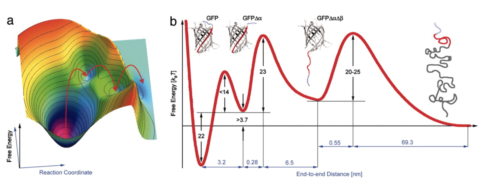
	
It making it easy to fall into a non-functional state that is hard to jump out of in most conventional simulations. Replication can be used to escape those minima, but the difficulty increases when the event you want to observe is rare.

Also, we are not only interested in the global minimum, but rather in the ones that are biologically functional, as they can be relevant events. Examples of this are:

* More than one pathway to arrive to the same conformation: a main one and other biologically possible ones that are less used. Gathering information about those could be interesting.
* In case of the transport through membranes, channels and transporters have to undergo large conformational changes in the course of gating substrates.

But sampling those conformational states is difficult because of the high energy barriers, and limits our ability to analyse and reveal functional properties of the systems being examined.

The following image shows one of those states:

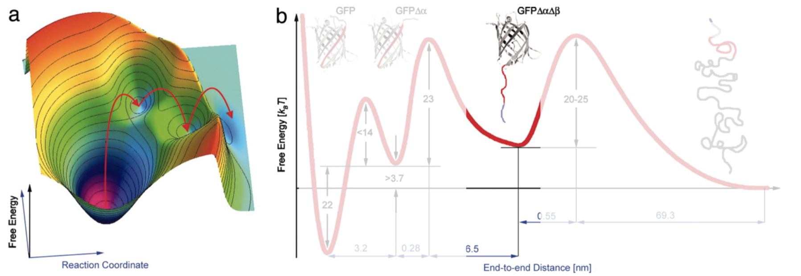

In conclusion, escaping local minima is complicated and time consuming, and straightforward MD simulations cannot handle this. Algorithms that are able to sample conformational states are needed. They are divided in two categories:

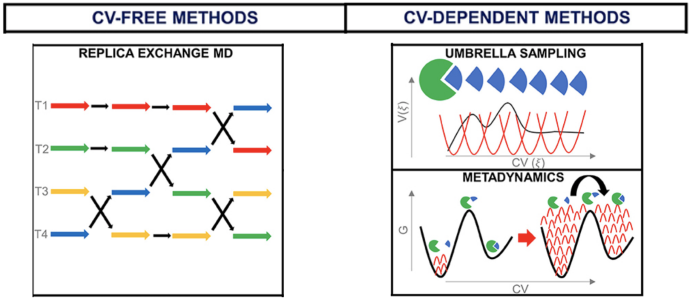

> CVs are collective variables, which are used by most sampling algorithms to describe the progress of a pathway. An example is "distance between the ends".

### CV-Dependent Methods

#### Metadynamics

This method was developed by Parrinello's group in order to improve sampling of systems where ergodicity is hindered by the form of the system's energy landscape by adding memory to the system. *A. Laio, M. Parrinello, Escaping free-energy minima, Proc. Natl. Acad. Sci. U. S. A. 99 (2002) 12562–12566*

**Ergodic Processes**

A process is ergodic when its statistical properties can be deduced from a single, sufficiently long, random sample of the process. For example, in a small system for which you can describe the whole phase space (its conformations) assuming you have enough time.

In the following image, the green rectangle is a phase space, and the yellow is another:

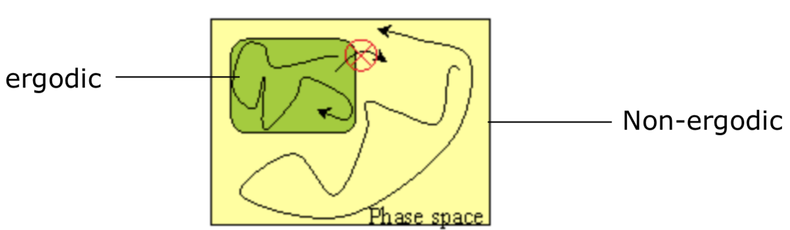

* It is possible to sample the green it entirely because it is small. This represents how most molecular systems are.
* Sampling a part of the yellow doesn't allow to arrive to green space, as they are not connected. This applies in cases such as bond breaking. Quantum mechanics allows to define bond breaks, unlike with molecular mechanics.

Note that the big space could be subsetted into smaller spaces to solve the problem, but then it is not a single sample, so it cannot be considered ergodic.

**Procedure of Metadynamics**

We start by defining the CV and plotting the energy landscape of the system. In the example below we see a structure that was crystallised at a stage that is a local minimum (1st graph).

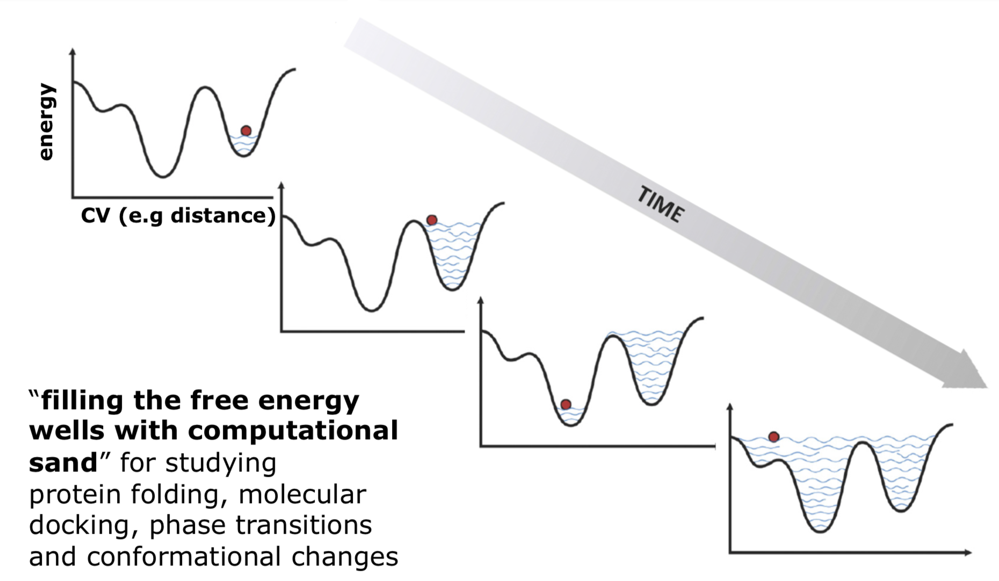
	
After a certain time defined in the simulation protocol (for example, after 3000 integration steps of 2 or 4 fs, which are 6 ps).

When this time passes, a defined amount of energy is added. This energy is not just a value (which would be represented in the plot as a vertical line), but rather a gaussian distribution with a defined height and width. That is why the increases of energy are called hills.

As we add a hill, the potential energy function is increased. If we added just one, the structure would fall to the minimum again, then it would climb again and after 6 ps, fall again. To prevent this, more hills are added until the vale is filled and the structure cannot go to the bottom. The consequence of this is that the energy barrier is decreased. We keep the information about the number of hills added and their shape, so we know how much energy we are adding to the landscape. *I guess this means that we don't end up with a biased landscape*.

As the hills remain in the vale once it has been filled it prevents that it is resampled. That's why it is said that this method **introduces memory to the system**.

Defining the shape of the hills can be done with big energy values, allowing to get a rough idea of the landscape. To be more accurate, smaller values are used. The bigger the value, the faster a vale is filled.

Convergence in metadynamics is achieved when everything has flattened out, so any hill you add results in staying in the same place. In papers, convergence is demonstrated by showing the last plots of the profile: if they are the same, convergence is achieved. It is also possible that maybe one part has converged and others not. In that case, it would be acceptable to say that there is convergence if we are only interested in that part.

The procedure is computationally fast, as 6 ps is nothing, while with unbiased simulations we could never scape the minimum. At the end, we will have information about the whole energy landscape.

The idea of the process can be seen in the following [video](https://www.youtube.com/watch?v=IzEBpQ0c8TA).

The following example has two collective variables plotted. The entrance of ions is studied: `a`, `b` and `c` are different places where an ion can be found, with energetic barriers between each of them.

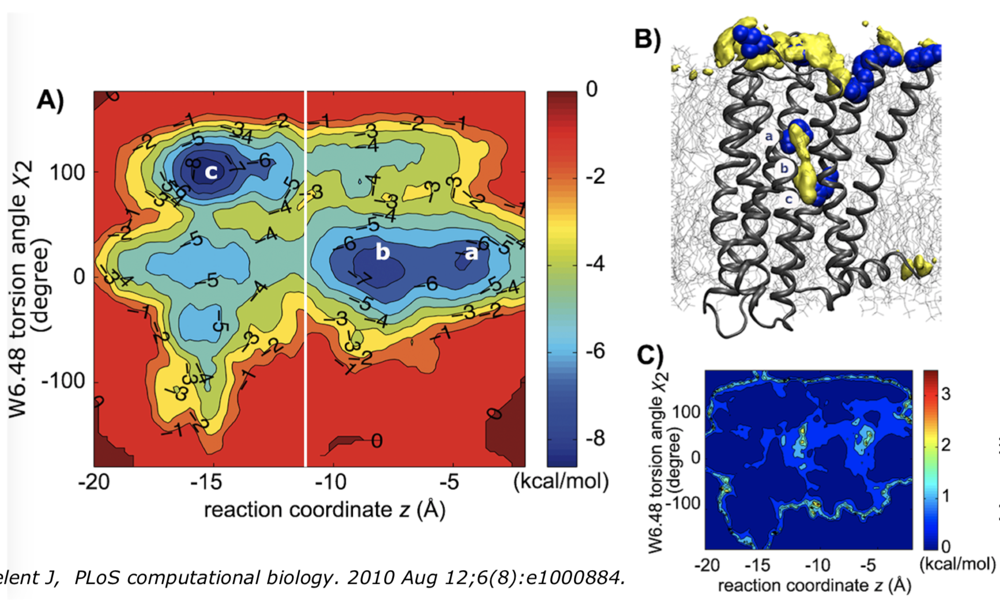

What they did was to filled up the landscape for the Z coordinate to follow the entrance. This was done with respect to the torsion angle of one chain. They saw that between `a` and `b` there is 1 kcal of difference to overcome to pass from one state to the other.

The cause of the high barrier from `b` to `c` can be explained structurally with the following image. We see that there is a residue blocking the way. When energy is added, the ion can pass through because a residue moves.

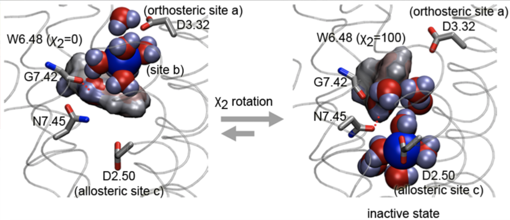

**Summary**

Metadynamics does depend on a low dimensionality of the system in order to produce an accurate description of the free energy surface, therefore using a small set of collective coordinates is essential. Ideally one CV is used, two if it is needed for a better description, but three makes it very difficult to converge.

Such characteristics allow this method to be quickly used to provide qualitative information about the overall topology of the free energy surface being examined.

#### Umbrella Sampling

To calculate the energetic landscape using umbrella sampling, the pathway needs to be known beforehand. The following example shows how a molecule moves closer to the other structure, until it binds. Each state corresponds to an energy, where the bound state is the global minimum and the unbound to a local minimum, with a barrier in between.

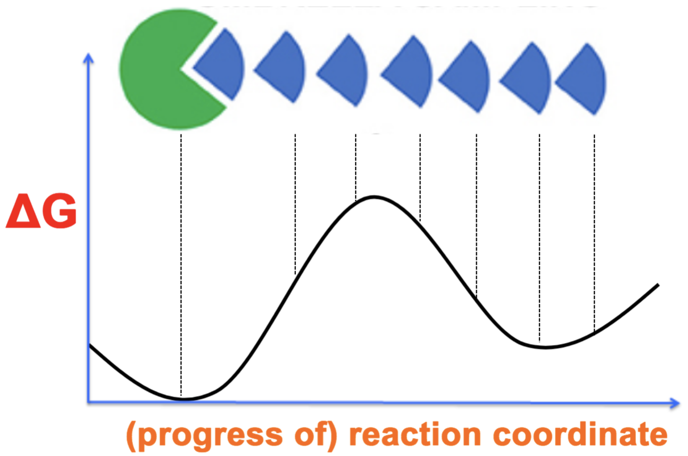
	
By taking a sample the image below, then we would not get the binding. 

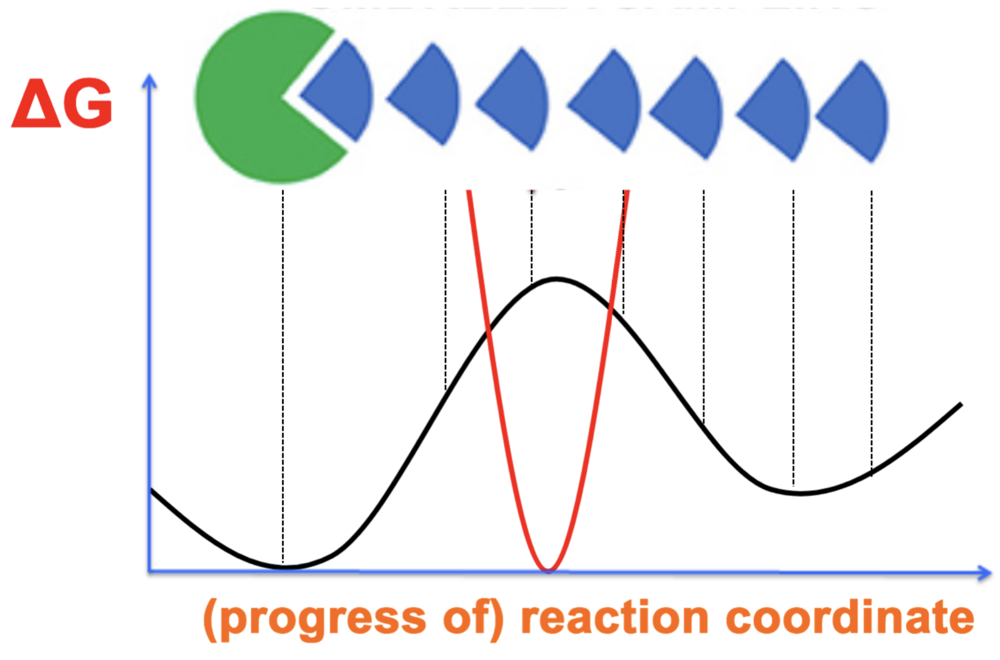

Instead, the method starts from snapshots along the pathway (unbiased simulations), and energy or force is added in order to sample around an area. Simulations for the different conformations are then run in parallel. Note that the snapshots need to overlap.

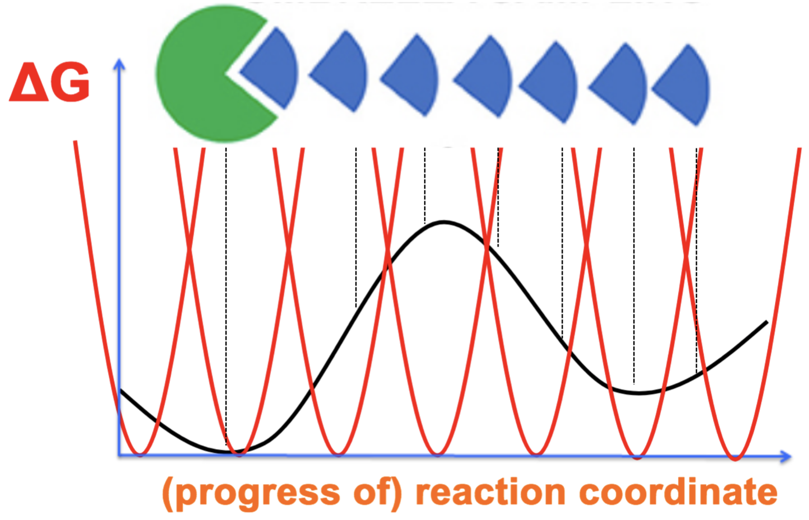
	
Once you know the landscape, you know the difference between the bound and unbound states. Thus is interesting for drug design, as the affinity of a drug is higher when the energetic barrier is big. This is usually solved by trying to lower the barrier (some cofactors do this). <!--There is other possibility instead of lowering the barrier, didn't listen to it.-->

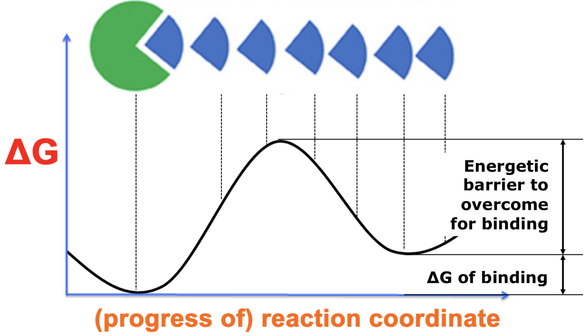
	
**Comparing Metadynamics and Umbrella Sampling**

While metadynamics and umbrella sampling are conceptually similar techniques to overcome free energy barriers, they have differences:

* Metadynamics is better suitable for finding reaction pathways. However, potential of mean force (PMF) calculations are highly dependent on input parameters (including the height and width of the Gaussian and !"). The appropriate choice for these parameters is crucial for accurate calculations.
* Umbrella sampling is useful to calculate accurate PMF. *It allows calculating very accurate energetic landscapes, as you indicate exactly what you want to sample in each simulation.*

A possible strategy would be to use metadynamics to know the pathway and have a general idea, and then pull from here the states we are interested in and do umbrella sampling. An alternative would be to generate artificially the pathway by pulling the ligand out. This can be done manually, but is not as good as you are defining the pathway, and also it doesn't always work, as some ligands first bind a recognition site, and then the actual binding site.

### CV-Free Methods: Replica Exchange

A set of non-interacting replicas runs at different values of an exchange variable, usually temperature (T-REMD), but there are other alternatives (pH, pressure, etc). At specific intervals, replicas at neighbouring values for the exchange variable are swapped randomly.

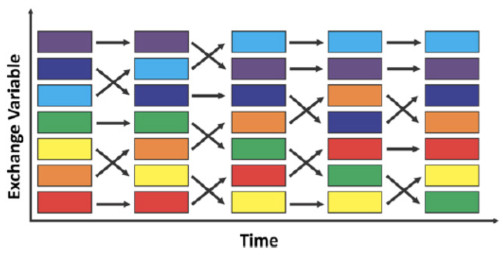

In the case of temperature, the fact that it increases can make the simulation overcome the energetic barrier, while decreasing it means that the well is sampled better. Temperature can also be good in unbiased simulations to overcome the energetic barrier, as it adds energy and might make the system more flexible and with more movement. But in some cases, the system can misbehave, so lowering the temperature is a good idea.

In an efficient run, all trajectories will experience changing of the exchange variable value. At each value for the exchange variable, the trajectories will be discontinuous, but follow a proper Boltzmann distribution for the specific value being exchanged.

The main advantages of this method are a gain of flexibility, overcoming ergodicity, and also a good parallelisation.

Applications:

* Sampling of different conformational states (e.g protein folding). In protein folding it has been used as a benchmark by comparing how quick and accurately the folding is reproduced.
* Study of protein protonation states, which might have a role in the protein active conformation.
* Usage in non-ergodic systems such as ... <!--mdc-->

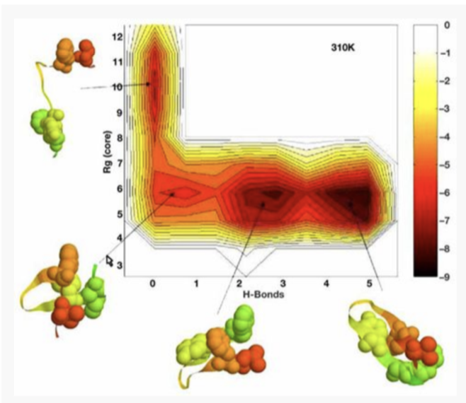

### PLUMED

PLUMED is a consortium to provide code for different enhanced sampling approaches for different simulation software. Here is an [explanative video](https://www.youtube.com/watch?v=PxJP16qNCYs) and the [installation procedure](https://www.plumed.org/doc-v2.5/user-doc/html/_installation.html). To incorporate it into GROMACS, a patching procedure is needed.

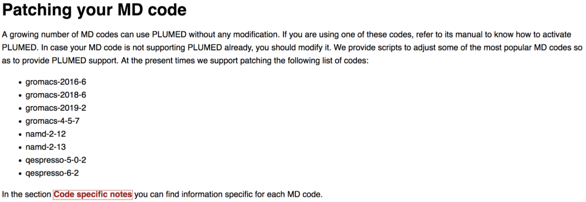

