## C8. Beyond Classical MD: Enhanced Sampling Techniques

<!--Date: 04/05/2019-->

### Introduction

Computer simulations of biomolecular systems have grown rapidly over the past few decades: from small molecules in vacuum (>20 atoms) to large protein complexes in a solvated lipid bilayer environment (>20000 atoms). 

However, despite its success, MD simulations are still limited in two regards:

* Inaccuracy of force fields: 
	* Force fields are simplifications based on collections of experimental data and ab initio calculations of how the system behaves.
	* Over the years have been refined, as this was needed to achieve longer simulation times with larger systems.
	* They describe the main energy function, but still can have some inaccuracy with certain kinetics.
	* Note that the stability of a system with time depends on its size: the smaller they are, the longer they can be simulated.
* High computational cost: it is needed half a year to simulate on the milisecond level, unless a supercomputer is used. 100 μs simulation of a relatively small systems (approximately 25,000 atoms) running on state-of-the-art computing archictecture requires a month of computation to complete.

Biological molecules are known to have rough energy landscapes, with many local minima frequently separated by high-energy barriers, as the following image of a protein folding process shows:

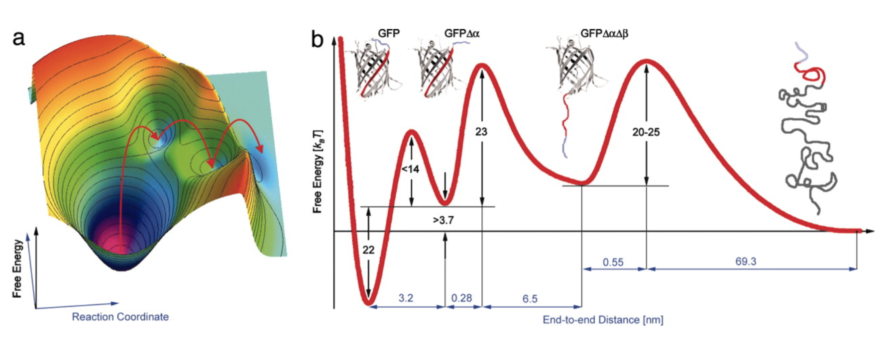
	
It making it easy to fall into a non-functional state that is hard to jump out of in most conventional simulations. Replication can be used to escape those minima, but the dificulty increases when the event you want to observe is rare.

Also, we are not only interested in the global minimum, but rather in the ones that are biologically functional, as they can be relevant events. Examples of this are:

* More than one pathway to arrive to the same conformation: a main one and other biologically possible ones that are less used. Gathering information about those could be interesting.
* In case of the transport through membranes, channels and transporters have to undergo large conformational changes in the course of gating substrates.

But sampling those conformational states is difficult because of the high energy barriers, and limits our ability to analyze and reveal functional properties of the systems being examined.

The following image shows one of those states:

In conclusion, escaping local minima is complicated and time consuming, and straightforward MD simulations cannot handle this. Algorithms that are able to sample conformational states are needed. They are divided in two categories:

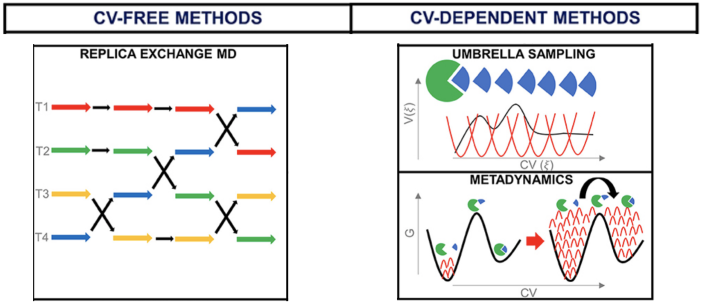

> CVs are collective variables.

### CV-Dependent Methods

#### Metadynamics

This method was developed by Parrinello's group in order to improve sampling of systems where ergodicity is hindered by the form of the system's energy landscape. *A. Laio, M. Parrinello, Escaping free-energy minima, Proc. Natl. Acad. Sci. U. S. A. 99 (2002) 12562–12566*

A system is ergodic when its statistical properties can be deduced from a single, sufficiently long, random sample of the process. For example, in a small system for which you can describe the whole phase space (its conformations) assuming you have enough time.

In the following image, the green rectangle is a phase space, and the yellow is another:

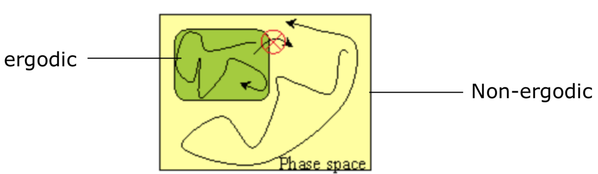

* It is possible to sample the green it entirely because it is small. It represents how most molecular systems are.
* Sampling a part of the yellow doesn't allow to see the green space, as they are not connected.

Note that the big space could be subsetted into smaller spaces to solve the problem, but then it is not a single sample, so it cannot be considered ergotic.

*Bond breaking is not observed usually (has to do with ergodicity* Quantum mechanics can define bond breaks, and allows something that this mechanics dont

Metadynamics **solves the problem** by inserts memory in the sampling. We start by plotting the energy landscape of the system. In the example below we see a structure that was crystallised at a local minimum (1st graph).

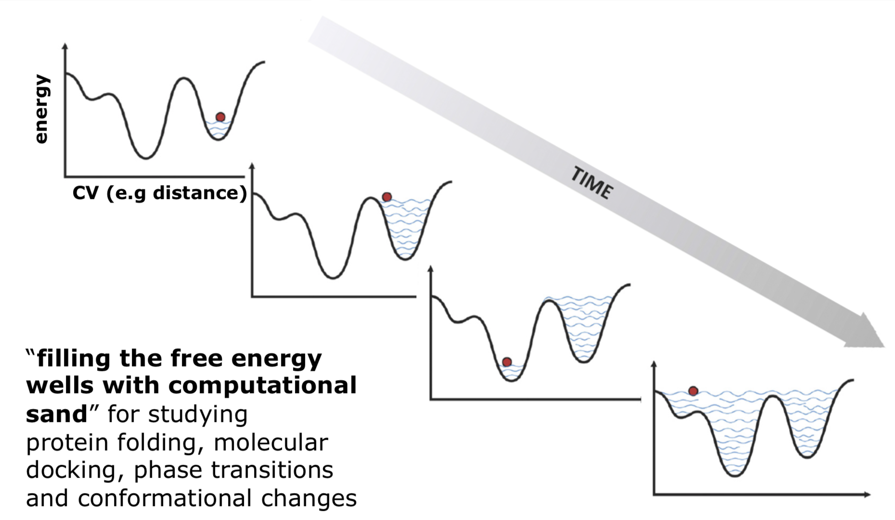

A time is defined in the sim protocol. *After 3000 integration steps, which are 2 fs.* When this time passes, a hill is inserted by changing the potential energy function. Hills are increases of energy. They are not lines, but rather distributions (we define their height, which defines their energy, and width).

As we a hill, the potential energy is increased. If we added just one, the structure would fall to the minima, so more hills are added until the vale is filled and the structure cannot go to the bottom. The consequence of this is that the energy barrier is decreased.

The procedure is computationally fast, as 6 ps is nothing, while with unbiased simulations we could never scape the minimim. At the end, we will have information about the whole energy landscape.

We always have the information on how many hills we are adding and about their shape, so we know how much energy we are adding to the landscape. *I guess this means that we don't end up with a viased landscape*. Also, the hills remain in the vale once it has been filled, preventing that it is resampled. That's why it is said that this method **introduces memory to the system**

How we define the hills? We can start with height big values, in order to get an idea of the landscape. For getting accuracy, smaller values are used.

Convergence in metadynamics is achieved when everything has flattened out, so any hill you add results in staying in the same place. Before min 42.

A [video](https://www.youtube.com/watch?v=IzEBpQ0c8TA) about this.

The following example has two collective variables plotted. a, b and c are different places where an ion can be found.

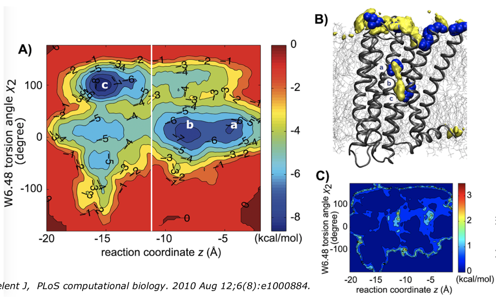

The cause of the high barrier that is observed can be explained with the following image. When energy is added, the ion can pass through because a residue (or atom??) moves.

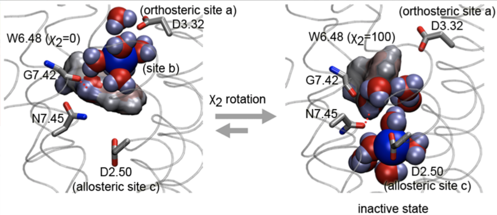

**Summary**

Metadynamics does depend on a low dimensionality of the system in order to produce an accurate description of the free energy surface, therefore using a small set of collective coordinates is essential.

Such characteristics allow this method to be quickly used to provide qualitative information about the overall topology of the free energy surface being examined.

#### Umbrella Sampling

In umbrella sampling, the pathway needs to be known beforehand. The following example shows how a molecule moves closer to the other structure, until it binds. Each state corresponds to an energy, where the bound state is the global minimum and the unbound to a local minimum, with a barrier in between.

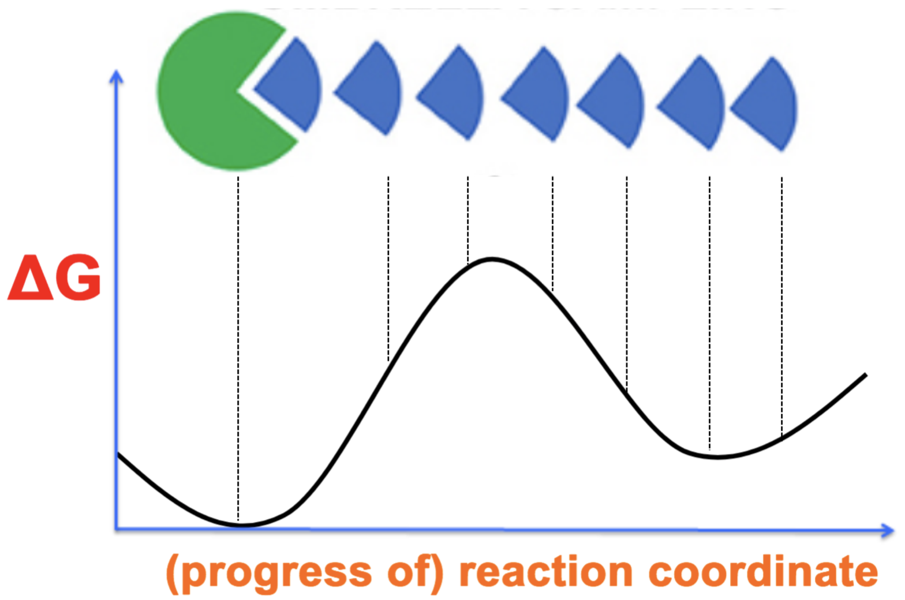

The method starts from snapshots of the pathway, and energy or force is added in order to sample around an area.

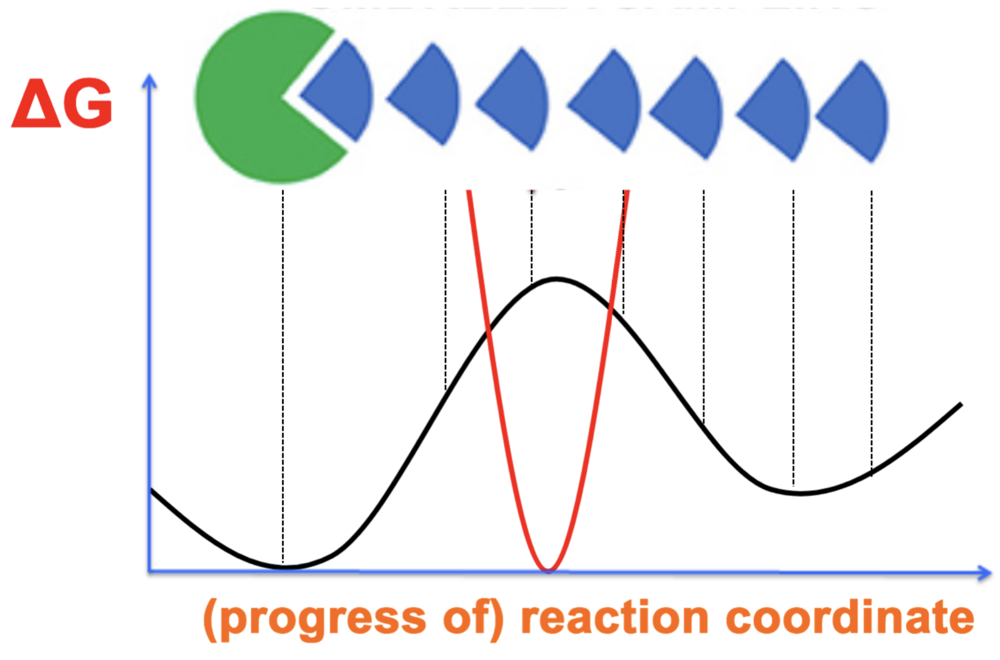

Like that, you just have a small patch of the whole energetic landscape, but with parallelization, you can run different simulations from different conformations, which need to overlap.

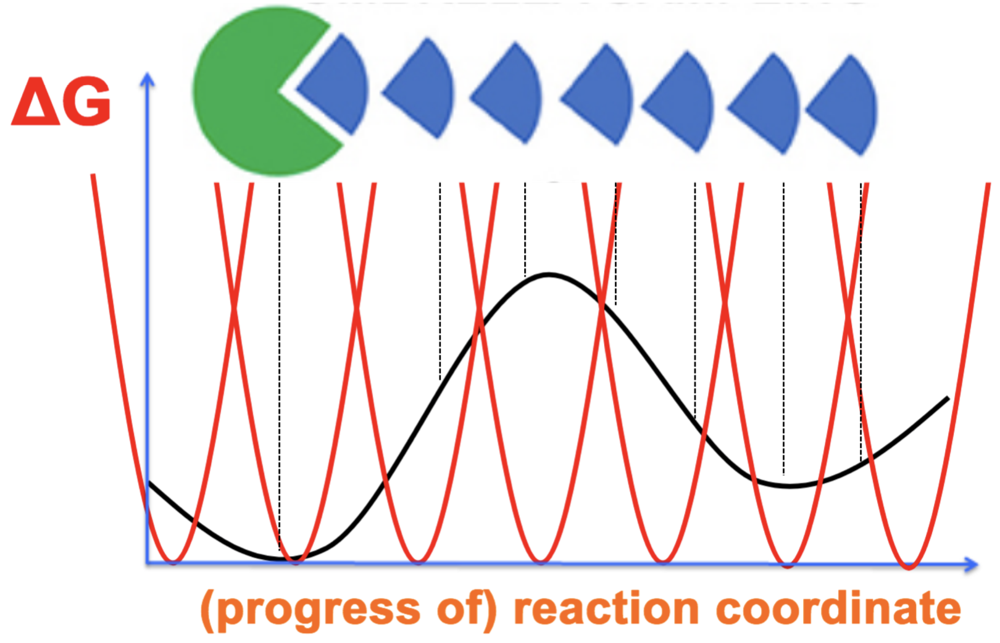
	

Once you knwo the landscape, you know the energetic landscape... bef min 53

Drug design: interesting approach.

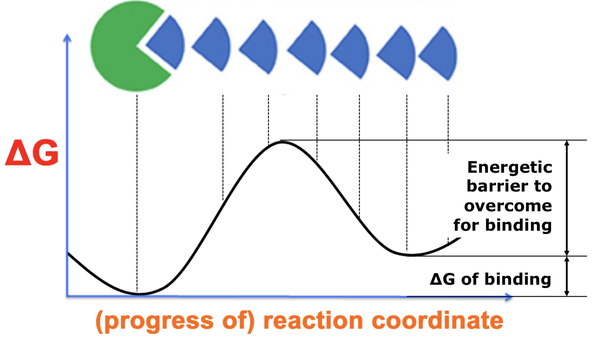
	
**Comparing Metadynamics and Umbrella Sampling**

While metadynamics and umbrella sampling are conceptually similar techniques to overcome free energy barriers, they have differences:

* Metadynamics is better suitable for finding reaction pathways. However, potential of mean force (PMF) calculations are highly dependent on input parameters (including the height and width of the Gaussian and !"). The appropriate choice for these parameters is crucial for accurate calculations.
* Umbrella sampling is useful to calculate accurate PMF. *It allows calculating very accurate energetic landscapes.*

A possible strategy would be to use metadynamics to know the pathway, and then do umbrella sampling. An alternative would be to generate artificially the path by pulling the ligand out. This can be done manually, but is not as good, and also it doesn't always work, as some ligands first bind a recognision site, and then the actual binding site.

### CV-Free Methods: replica exchange

A set of non-interacting replicas runs at different values of an exchange variable, usually temperatura (T-REMD).

At specific intervals, replicas at neighboring values for the exchange variable are swapped

In an efficient run, all trajectories will experience changing of the exchange variable value. At each value for the exchange variable, the trajectories will be discontinuous, but follow a proper Boltzmann distribution for the specific value being exchanged.

> Good for parallelization (10-20 sim at same time=. Independent, replicates dont interacr. The problem is that if you sample.
>
> The colors are temperatures. Scale is adapted to experiments.
> Low temps: energetic well better defined. 

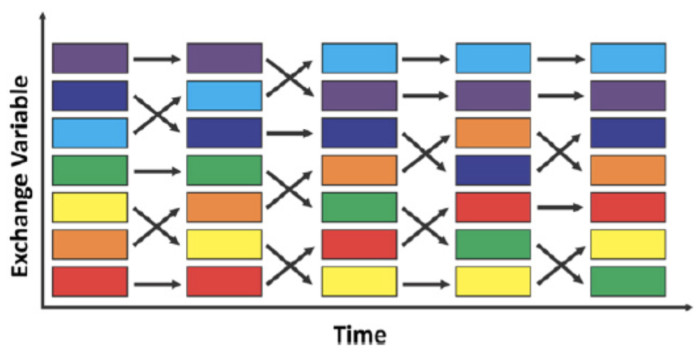

Exchange variables:

* Temperature
* pH value
* Pressure, etc.

Applications:

* Sampling of different conformational
states (e.g protein folding)
* Study of protein protonation states

> Here we can overcome ergodicity. Residues cna be protonetad or not depending to ph. 

Example: protein folding. 

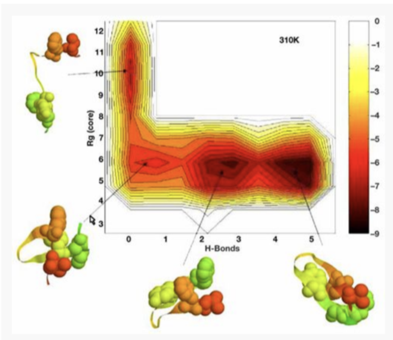

**PLUMED**

Consortium

https://www.youtube.com/watch?v=PxJP16qNCYs
https://www.plumed.org/doc-v2.5/user-doc/html/_installation.html

PLUMED is incorporated into gromacs using the patching procedure:

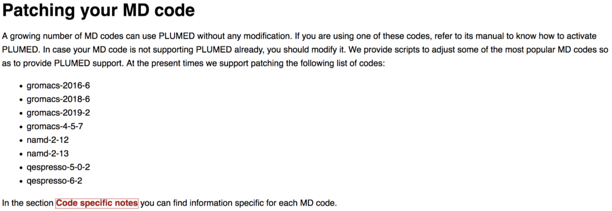

