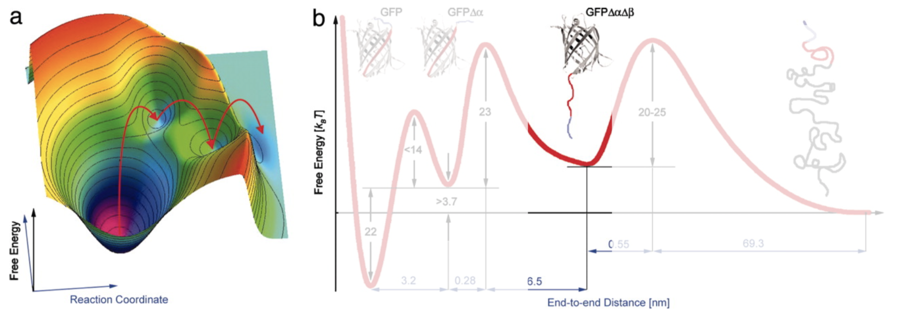

## C8. Beyond Classical MD: Enhanced Sampling Techniques

<!--Date: 04/05/2019-->

Computer simulations of biomolecular systems have grown rapidly over the past few decades: from small molecules in vacuum (>20 atoms) to large protein complexes in a solvated lipid bilayer environment (>20000 atoms). 

However, despite its success, MD simulations are still limited in two regards:

* inaccuracy of force fields: *collections of experimental data/ab initio calc of how the sys behaves. It is a simplification. Over the years have been refined (needed to be bc it was needed to long times of simulation: ie helix broke even if it should be stable). They work well for miliseconds in large simulations (the smaller, the longer it can be stable).*
* high computational cost. *1/2 year to calc miliseconds. There is the pos of supercomputer, but this requires to pay.* 100 μs simulation of a relatively small systems (approximately 25,000 atoms) running on state-of-the-art computing archictecture requires a month of computation to complete.

Biological molecules are known to have rough energy landscapes, with many local minima frequently separated by high-energy barriers, making it easy to fall into a non-functional state that is hard to jump out of in most conventional simulations.

> Local minima surrounded by high barriers, and we can fall into there but they might not be a important state of the molecule. You would need to sim a lot to observe what you want. In 100 replicates maybe yoou only see one time it jumping and seeng the rare event (the more rare, the more diff)
> 
> The image shows how the protein folds. To overcome transition states you overcome big barriers tometimes.
> 
> Anyway, some local minima can be interesting, maybe they are involved on activation or so, so we are interesting on them. Everything depends on biological importance.

Such limitations can lead to inadequate sampling of conformational states, which in turn limits the ability to analyze and reveal functional properties of the systems being examined.

> Here something ab sampling problem. We try to sample the whole conformational state. Also there are pathways on them, maybe one is main and the others are biopossible, but less used.

Large conformational changes are often important for protein activity in biological systems, for example in case of the transport through membranes, channels and transporters have to undergo large conformational changes in the course of gating substrates.

Such complicated and time consuming processes are commonly beyond the ability of straightforward MD simulations and enhanced sampling algorithms are needed.
In the past few decades several methods have been developed for this:

> The most important are the image. They are going to be done in the hands on.CV = collective variable.
> 

To improve sampling of a system where ergodicity is hindered by the form of the system's energy landscape, Parrinello's group developed an algorithm - metadynamics - that inserts memory in the sampling.
A. Laio, M. Parrinello, Escaping free-energy minima, Proc. Natl. Acad. Sci. U. S. A. 99 (2002) 12562–12566

A process is said to be ergodic if its statistical properties can be deduced from a single, sufficiently long, random sample of the process. *If you sample for instance a small system, if you have enough time you can describe the whole phase space (conformations). Most molecular systems are like this. If you sample a part of the yellow, you never can see the green one, as they are not connected.* 
*Bond breaking is not observed usually (has to do with ergodicity*

*The green is a phase space as itself*

*Alda: sample the big space into smaller: but this makes it not be single sample (so is still non-ergotic* Quantum mechanics can define bond breaks, and allows something that this mechanics dont

What does metadynamics do?

Plot the energy. We see a crys structure crystallised on the local minimum (1st graph)

You define a time in the sim protocol. After certain time is energy. After 3000 integration steps, which are 2 fs.

Hill: the height and its weight. It is a distribution. Its not a line bc cannot.

The thing is that when time passes, we add the hill, which is energy. Potential energy is increased. So it would fall to the minima. What we do is adding more hills to fill the vale, so it cannot go to the bottom. You also know how much energy youre adding. This decreases the barrier.

This procedure is compp fast. 6 ps is nothing, and with regular (they are named unbiased)simulations you cuold never get out of the minima. The purpose is escaping the free energy minumum. You are not interested just in the global minima, but have the entire energetic landscape.

Hills are added by changing the energy potential function.

You know the energy you are adding each step, so you can know everything.

introducing memory on the system: this means that the hills of one vale are still there, to prevent resampling it.

> Definition of hills: first the values are big, so you have an idea on how the landscape is. This is rough, then you need more small energy. Height = energy, width is whatever. High energies are not accurate, but give a quick idea.
> 

A [video](https://www.youtube.com/watch?v=IzEBpQ0c8TA) about this.

> When it has converged? That it has flattened out, anything you add, you stay to the same. In real life, she said on audio. Before min 42.

Here we see two collective variables plotted. a, b and c are different places where the ion can be found.

We still see a high barrier, what is it? We see it in the following image. If you add energy, the ion can pass through bc a residue (or atom??) moves.

**Summary**

Metadynamics does depend on a low dimensionality of the system in order to produce an accurate description of the free energy surface, therefore using a small set of collective coordinates is essential.
Such characteristics allow this method to be quickly used to provide qualitative information about the overall topology of the free energy surface being examined.

#### Umbrella sampling

You need to know the pathway. Ie, binding of a small molecule, that moves closer and closer and bind. Each state corresponds to an energy, bound corresponfs to small energy, and unbound is a local minima, but there is a barrier in between.

As you know the pathway, you start from snapshots of the path. You put energy (or force) to sample around an area. 

Like that, you just have a small patch of the whole energetic landscape, but with parallelization, you can run diff simulation from different conformations. You make sure that they overlap.

Once you knwo the landscape, you know the energetic landscape... bef min 53

Drug design: interesting approach.

* Metadynamics and umbrella sampling are conceptually similar techniques to overcome free energy barriers.

* Metadynamics is better suitable for finding reaction pathways however potential of mean force (PMF) calculations are highly dependent on input parameters (including the height and width of the Gaussian and !"). The appropriate choice for these parameters is crucial for accurate calculations.
	> Umbrella needs the knowledge of pathway, while meta can get one.

* Umbrella sampling is useful to calculate accurate PMF
	> Calc very accurate energetic landscapes.
	
> We can do meta to know the path, then do umbrella. Other alternative is that 4 ligand binding, you can generate artificially the path by pulling it out. Can be done manually, but not as good. This not always works, there are ligands that first go to a recog site, then to the actual binding site.

### CV-Free Methods: replica exchange

A set of non-interacting replicas runs at different values of an exchange variable, usually temperatura (T-REMD).

At specific intervals, replicas at neighboring values for the exchange variable are swapped

In an efficient run, all trajectories will experience changing of the exchange variable value. At each value for the exchange variable, the trajectories will be discontinuous, but follow a proper Boltzmann distribution for the specific value being exchanged.

> Good for parallelization (10-20 sim at same time=. Independent, replicates dont interacr. The problem is that if you sample.
>
> The colors are temperatures. Scale is adapted to experiments.
> Low temps: energetic well better defined. 

Exchange variables:

* Temperature
* pH value
* Pressure, etc.

Applications:

* Sampling of different conformational
states (e.g protein folding)
* Study of protein protonation states

> Here we can overcome ergodicity. Residues cna be protonetad or not depending to ph. 

Example: protein folding. 

**PLUMED**

Consortium

https://www.youtube.com/watch?v=PxJP16qNCYs
https://www.plumed.org/doc-v2.5/user-doc/html/_installation.html

PLUMED is incorporated into gromacs using the patching procedure:

